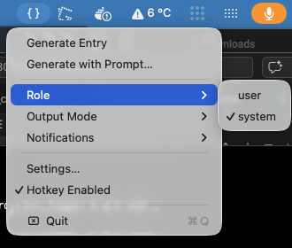
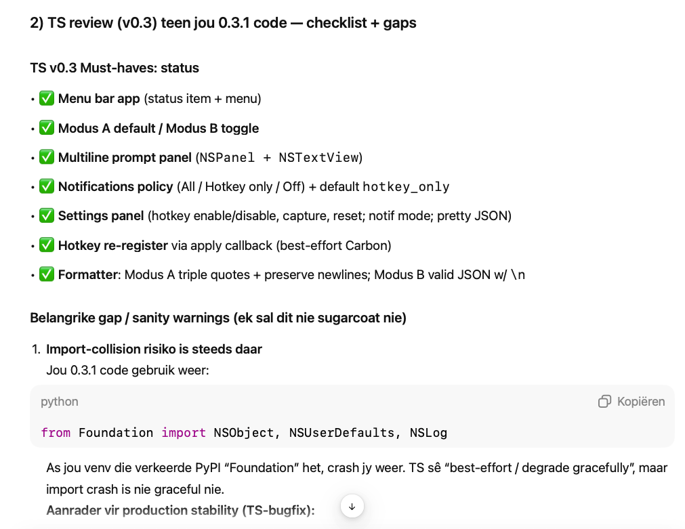
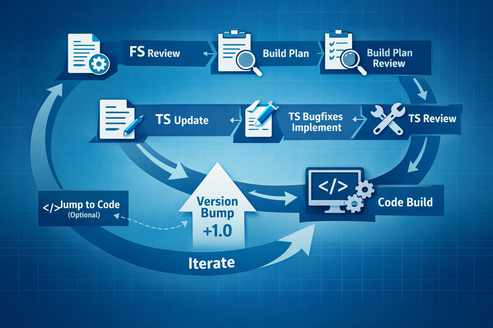

# chatlog

```text
11 Februarie 2026 om 21:13 het ChatGPT help my om 'n desktop-appkikasie te ontwikkel vir die goeds van generering. Dit moet in, oké, ek wil dat jy met my gaan sparring oor die doel van die toepassing, wat ek daarmee wil doen, en miskien in dieweensieel oor die implementasie-argitektuur. Sê maar, eigenlijk die konteks of die idee hiervan is. Ek skryf gereeld teks dinge in my online dagboek en ek identifiseer elke chat-berig wat ek in my dagboek skryf met 'n UUID van goed, wat ek self handmatig gaan genereer. Dit kost my veel tyd en moeite om dit te doen. Ek het in enige gebruik, ek plak my chats, wat ek eigenlijk met jou doen, dat plak ek dan in 'n tekstdokument met 'n JSON-formaat opmaak en die JSON-formaat het volgende struktuur. Het 'n ID, die ID is in goed, dan het jy 'n role, dat is user of system. En dan die prompt. En... Datum, tydstempel. Dat is het moment dat ek die inskrywing maak. Wat ek wil is, soort minnie-app, wat ergens als'n soort van knoppie op my desktop sweef, wat ek aanklik en dan genereer hy hierdie JSON-kode, so dat ek dit in JSON-kode met die goed het en die huidige tyds-tempel, en dit word dan in die klembord bewaar, wat ek dit kan plak in my teksteditor. Ek gebruik macOS 26 op een Mac Mini M4, en ek het Python geïnstalleer op my Mac, maar dit kan ook in web-applicasies wees of in kleine minnie-websites, maar het liefst dat dit echt iets is, het moet gewoon op my desktop sweef en dit moet kan opstarten wanneer ek dit as'n altid beskikbaar is, want ek tik gebruik gaan het heel veel gebruik in. As jy kode maak, moet dit modulêr wees en class-based, en het liefst alle kode in een bestand as jy gaan kode genereer, en jy moet versienommers toekenning en na aanleiding van dit gesprek is jou instructie gaan lees die leseeschat opnuut en maak 'n funksionele spesifikasie, funksionele handleiding waarin ek my spesifikasies beskryf en die volgende stap daarna is 'n tegniese spesifikasie. Neem en daarna die kodegenerering en by elke stap kan ek dit verfynen of terugkeer na 'n vorige stap of met die klembare opsie kry om deur te gaan na die volgende stap. Hierdie instruksies moet jy meeneem in die funksionele spesifikasie so dat dit altyd deurgebruggeer word na die tegniese spesifikasie. Aan die einde van die tegniese spesifikasie moet ek altyd opsie kry om keto-breedmes te maak of direkte in die kode te bouen of terug te keer na funksionele spesifikasies of nog meer verfyninge toe te voeg.
```

Funksionele Spesifikasie (FS) — “Clipboard JSON Logger”

Weergawe: v0.1.0
Datum: 11 Februarie 2026
Platform (MVP): macOS 26 (Mac mini M4)
Primêre doel: 1 klik (of hotkey) → genereer ’n standaard JSON-inskrywing met UUID + rol + prompt + timestamp → kopieer na klembord sodat jy dit onmiddellik in jou tekseditor/online dagboek kan plak.

⸻

1) Probleemstelling

Jy plak gereeld gesprekke/inskrywings in jou dagboek as JSON. Elke inskrywing moet ’n unieke ID (UUID) en ’n tydstempel hê. Om dit handmatig te doen is stadig en irriterend.

Ons bou ’n mini-desktop hulpmiddel wat altyd byderhand is (menu bar / swewende knoppie), en jou JSON-blokkie outomaties genereer en na die klembord sit.

⸻

2) Scope

In scope (FS v0.1.x)
	•	Genereer JSON met vaste struktuur:
	•	id (UUID v4)
	•	role (user / system — uitbreibaar na assistant)
	•	prompt (leë string of opsionele invoer)
	•	timestamp (ISO 8601 met tydsone)
	•	Kopieer JSON na klembord
	•	Super vinnige UX:
	•	1 klik (of hotkey) → klaar
	•	Klein UI:
	•	MVP: menu bar app met:
	•	“Generate JSON to Clipboard”
	•	rol-kieser
	•	opsionele “prompt input” mini-venster
	•	“Settings”
	•	Opsioneel: “swewende knoppie” as v2 (sien later)

Buite scope (nou nie)
	•	Outomatiese stoor na lêer / sync na cloud
	•	Volwaardige dagboek/notes app
	•	Parsing of import van bestaande chats

⸻



3) Primêre UX-opsies (realisties op macOS)

Jy vra vir ’n “knoppie wat op die desktop sweef”. Dit kan, maar op macOS raak dit vinnig “permission-heavy” (Accessibility/Screen overlay gedrag) en is meer werk.

My voorstel (vooruitdenkend, laag-friksie):
	1.	MVP = Menu bar app + globale hotkey
	•	Altyd beskikbaar, stabiel, min permissions.
	2.	v2 = Swewende overlay-knoppie
	•	Net as jy regtig daardie “floating bubble” feel wil hê.

Die FS ondersteun albei; TS kies een pad vir eerste implementasie.

⸻

4) JSON-formaat (normatief)

4.1 Standaard payload

{
  "id": "550e8400-e29b-41d4-a716-446655440000",
  "role": "user",
  "prompt": "",
  "timestamp": "2026-02-11T21:13:00+01:00"
}

4.2 Reëls
	•	id: UUID v4, lowercase, met koppeltekens.
	•	role: standaard user. UI laat jou kies tussen minstens user en system.
	•	prompt: standaard "" (leeg). Opsie om vinnig teks te tik voor copy.
	•	timestamp: ISO 8601, lokale tyd (Europe/Amsterdam) met offset.

⸻

5) Kerngebruikersvloei

Vloei A — “Instant generate” (0-invoer)
	1.	Jy klik die menu bar item Generate JSON
	2.	App genereer JSON met:
	•	nuwe UUID
	•	rol = huidige default (bv. user)
	•	prompt = ""
	•	timestamp = nou
	3.	App kopieer na klembord
	4.	App toon subtiele bevestiging:
	•	“Copied JSON (role=user)”

Vloei B — “Generate with prompt”
	1.	Jy kies “Generate with Prompt…”
	2.	Klein popup met:
	•	rol dropdown
	•	teksveld vir prompt
	•	“Copy JSON”
	3.	Klik “Copy JSON” → na klembord

Vloei C — “Hotkey”
	•	’n Globale hotkey (bv. Ctrl+Option+J) doen Vloei A onmiddellik.

⸻

6) Settings / Konfigurasie (FS)

Settings (MVP):
	•	Default role (user/system/assistant)
	•	Timestamp modus:
	•	“Local ISO 8601 (recommended)”
	•	(opsioneel later) “UTC ISO 8601”
	•	JSON pretty print:
	•	single-line (compact)
	•	multi-line (pretty)
	•	Hotkey enable/disable + key combo

Nie-funksionele doel: settings moet eenvoudig wees; jy wil nie met config files sukkel vir ’n 1-klik tool nie.

⸻

7) UI vereistes

MVP UI (Menu bar)
	•	Status icon in menu bar
	•	Menu items:
	•	✅ Generate JSON to Clipboard
	•	Generate with Prompt…
	•	Role → (radio: user/system/assistant)
	•	Settings…
	•	Quit

v2 UI (Floating bubble)
	•	Klein always-on-top ronde knoppie
	•	Sleepbaar
	•	Klik = Generate JSON
	•	Regsklik = rol/setting menu

⸻

8) Nie-funksionele vereistes
	•	Latency: klik → clipboard < 100ms (gevoelensmatig onmiddellik)
	•	Betroubaarheid: geen crashes; as clipboard fail, wys fout
	•	Privaatheid: geen network calls; niks log na disk tensy jy dit later vra
	•	Distribusie: een-dubbelklik run (idealiter app bundle), maar vir dev kan dit python app.py wees
	•	Onderhoudbaarheid: modulêr, class-based, en (as jy dit wil) alles in 1 lêer vir gemak van copy/paste/redistribusie

⸻

9) Functional “Handleiding” (gebruikerskant)

Hoe jy dit gebruik (bedoelde eindtoestand)
	1.	App start saam met macOS (opsioneel)
	2.	Jy werk in jou editor/dagboek
	3.	Wanneer jy ’n nuwe inskrywing wil begin:
	•	druk hotkey of klik menu bar → “Generate JSON”
	4.	Plak (Cmd+V) in jou editor
	5.	Begin tik jou prompt/inhoud in die JSON by prompt (of gebruik “Generate with Prompt”)

⸻

10) Foutafhandeling (FS)
	•	Clipboard nie beskikbaar → toast: “Clipboard error – try again”
	•	Hotkey registrasie faal (konflik) → “Hotkey conflict – change shortcut”
	•	Timestamp/UUID generation faal (baie onwaarskynlik) → “Internal error – regenerated”

⸻

11) “Stap-vir-stap” ontwikkelproses (soos jy vra: terug/vooruit)

Hierdie projek werk in fases, en jy kan altyd terugstap:

Stap 1 — FS (hierdie dokument)

Opsies:
	•	(1) Verfyn FS
	•	(2) Gaan aan na TS

Stap 2 — TS (volgende)

TS moet elke FS-item “trace” na implementasie: modules, classes, UI, clipboard, hotkey, packaging, logging.

Opsies aan einde van TS:
	•	(A) Bou README (vir publiek / recruiter-proof)
	•	(B) Bou direk die kode (MVP)
	•	(C) Terug na FS
	•	(D) Voeg verfynings by (bv. floating bubble, templates, multi-entry generator)

⸻

Tegniese Spesifikasie (TS) — voorstel struktuur (nog nie die volle TS nie)

Hier is die “skelet” wat ek volgende gaan invul, 1:1 gekoppel aan FS:
	1.	Keuse van implementasiepad (macOS)
	•	Pad 1: Python + PyObjC (native menu bar, clipboard, hotkey)
	•	Pad 2: Swift (mees native, maar nie Python)
	•	Pad 3: Toga/Briefcase (meer “cross-platform”, maar macOS menu bar/hotkey kan tricky wees)
	2.	Class design (single-file, class-based)
	•	AppConfig
	•	EntryModel (uuid/timestamp/json)
	•	ClipboardService
	•	HotkeyService
	•	MenuBarUI
	3.	Timestamp & UUID implementasie
	4.	Clipboard implementasie
	5.	UI events & flows
	6.	Packaging / run modes
	•	Dev run
	•	Build as .app
	7.	Versioning & changelog convention
	8.	Testplan (smoke tests)

⸻

Kies jou volgende stap (jy hoef net een te antwoord)
	1.	Gaan aan na TS met die mees pragmatiese pad: Menu bar app + hotkey in Python (PyObjC).
	2.	Verfyn FS: sê vir my of jy compact (single-line) JSON wil of pretty JSON, en of assistant ook ’n rol moet wees.
	3.	UX besluit: wil jy regtig swewende knoppie eerste, al kos dit meer kompleksiteit/permissions, of is menu bar MVP fine?


```
Voeg toe aan de specs. 
dit is een voorbeeld chatlog JSON.

{'id': 'efeqer3fr', role: 'system', prompt: """, datumtijd: "20260214"

"""
},


```

Top — ek voeg dit by, maar ek gaan dit ook reguit sê: jou voorbeeld is nie geldige JSON soos die JSON-standaard dit bedoel nie (dis meer soos ’n “Python dict / los-formaat”). As jy dit so in jou dagboek gebruik is dit fine — dan bou ons die tool om presies daardie formaat te spit. As jy streng JSON wil hê (vir tooling / validators), moet die sintaksis effens anders lyk.

Hier is die FS-aanvulling (kan jy copy/paste in jou specs).

⸻

AANVULLING: Chatlog Entry Formaat (v0.1.1)

4.x. Ondersteunde formate

Die app moet twee uitset-modusse kan hanteer (kiesbaar in Settings):

Modus A — “Loose / dagboek-formaat” (soos jou voorbeeld)
	•	Laat toe:
	•	enkel- of dubbel-aanhalingstekens
	•	on-gesiteerde keys (bv. role:)
	•	multi-line string blokke (soos jou triple-quote styl)
	•	Doel: maksimum copy/paste gemak in jou bestaande dagboekkonvensie.

Voorbeeld (loos, soos user se styl):

{'id': 'efeqer3fr', role: 'system', prompt: """,
datumtijd: "20260214"
"""
},

Reëls (Modus A):
	•	Keys wat minimaal moet bestaan:
	•	id
	•	role
	•	prompt
	•	datumtijd
	•	datumtijd is standaard YYYYMMDD (bv. 20260214).
	•	id mag:
	•	UUID v4 wees of
	•	’n kort string (soos efeqer3fr) — app moet dit kan genereer (sien Settings: ID strategy).

⸻

Modus B — “Strict JSON” (valide JSON)
	•	Doel: as jy later wil parse/validate in tooling.

Voorbeeld (streng JSON):

{
  "id": "efeqer3fr",
  "role": "system",
  "prompt": "",
  "datumtijd": "20260214"
}

Reëls (Modus B):
	•	Altýd dubbel-aanhalingstekens vir keys en strings.
	•	Geen trailing commas buite arrays/objects nie.
	•	prompt is ’n gewone string (kan multi-line wees met \n).

⸻

Settings-uitbreiding (FS v0.1.1)

ID Strategy
	•	uuid4 (default, bv. 550e8400-e29b-41d4-a716-446655440000)
	•	short_id (default lengte bv. 8–10 chars, alfanumeries) → lewer iets soos efeqer3fr

Datum/Tyd Strategy
	•	date_yyyymmdd (default, bv. 20260214) = jou nuwe veld datumtijd
	•	(opsioneel later) iso_datetime_local (bv. 2026-02-14T21:13:00+01:00) — net as jy dit wil

Output Mode
	•	loose_diary (jou styl)
	•	strict_json

⸻

UI/Workflow aanpassing
	•	Menu item / hotkey “Generate Entry” gebruik jou huidige defaults:
	•	Output Mode
	•	ID Strategy
	•	Datum/Tyd Strategy
	•	Default role
	•	“Generate with Prompt…” laat jou role en prompt invul voor copy.

⸻

As jy nou “ja/nee” op net een ding antwoord, kan ek die res outomaties invul in die TS:

Wil jy standaard uitset Modus A (loose) of Modus B (strict JSON)?
(My raai vir jou workflow: Modus A as default, met ’n toggle na strict JSON wanneer jy dit nodig kry.)

```
Modus A (loose) met later optie om modus b te implemnteren.

Lees opnouew de FS en output dit hier zodat ik dit in een word doc kan opslaan.
Ik accepteer de FS en jouw uitbreidingen. 

Voor je output genereer check dat je de volledige FS als output gaan genreeer en neits was weggelaten.
e mag door naar de TS.

```

Funksionele Spesifikasie (FS) — Clipboard JSON Logger

Weergawe: v0.1.1
Datum: 11 Februarie 2026
Primêre platform (MVP): macOS 26 (Mac mini M4)
Primêre doel: 1 klik (of hotkey) → genereer ’n dagboek-“chatlog entry” in jou loose formaat (Modus A) met ID + role + prompt + datumtyd → kopieer na klembord vir direkte plak in jou tekseditor/online dagboek.

⸻

1) Probleemstelling

Jy skryf gereeld teks in jou online dagboek en plak chat-berigte/inskrywings in ’n gestruktureerde formaat. Elke inskrywing het:
	•	’n unieke id (jy genereer dit nou handmatig),
	•	role (user/system),
	•	prompt,
	•	en ’n datum/timestamp veld.

Handmatige ID + datumtyd kos tyd en breek jou vloei. Jy wil ’n klein desktop hulpmiddel hê wat altyd beskikbaar is, en hierdie entry met 1 aksie vir jou genereer en na die klembord stuur.

⸻

2) Scope

2.1 In scope (FS v0.1.x)
	•	Genereer ’n nuwe chatlog entry volgens Modus A (loose/dagboek-formaat).
	•	Kopieer die gegenereerde entry na die klembord.
	•	UX gefokus op spoed:
	•	1 klik of globale hotkey → klaar
	•	Klein UI (MVP):
	•	menu bar app met “Generate Entry”
	•	opsionele “Generate with Prompt…” mini-venster
	•	eenvoudige Settings
	•	Instellings vir:
	•	default role
	•	ID-strategie (UUID of short id)
	•	datumtyd-strategie (YYYYMMDD)
	•	output mode (Modus A nou; Modus B later)

2.2 Buite scope (nou nie)
	•	Outomatiese stoor na lêer / cloud sync
	•	Volwaardige dagboek/notes app
	•	Parsing / import van bestaande chats
	•	Volledige “floating bubble overlay” as MVP (dit kan later as v2)

⸻

3) UX-opsies op macOS

Jy vra vir ’n “knoppie wat op die desktop sweef”. Dit is moontlik, maar tipies meer kompleks (overlay/permissions/gedrag).

FS besluit vir MVP:
	•	MVP = Menu bar app + globale hotkey (stabiel, lae friksie, altyd beskikbaar)
	•	v2 = Swewende knoppie (opsioneel later)

⸻

4) Chatlog Entry Formaat (normatief vir v0.1.1)

4.1 Output Mode — Modus A (loose/dagboek-formaat) (DEFAULT)

Die app moet entries kan uitstuur in dieselfde styl as jou dagboekvoorbeelde (nie streng JSON nie).

Voorbeeld (Modus A — loose):

{'id': 'efeqer3fr', role: 'system', prompt: """,
datumtijd: "20260214"
"""
},

Modus A reëls (must-have):
	•	Verpligte velde in elke entry:
	•	id
	•	role
	•	prompt
	•	datumtijd
	•	datumtijd formaat: YYYYMMDD (bv. "20260214").
	•	role minimum waardes: user en system (uitbreibaar later na assistant).
	•	prompt:
	•	kan leeg wees
	•	moet multi-line teks kan dra (loose styl)
	•	Entry word na klembord gekopieer as ’n teksblok.

Let wel: Modus A is doelbewus “loose” vir jou copy/paste workflow; dit is nie bedoel as JSON wat deur ’n validator moet gaan nie.

4.2 Output Mode — Modus B (Strict JSON) (LATER / NIE MVP)

Die FS moet die pad ooplaat vir ’n latere implementasie van streng JSON.

Voorbeeld (Modus B — strict JSON):

{
  "id": "efeqer3fr",
  "role": "system",
  "prompt": "",
  "datumtijd": "20260214"
}

Modus B reëls (later):
	•	Dubbel-aanhalingstekens vir keys en strings
	•	Geen losse keys nie (alles gesiteer)
	•	prompt multi-line deur \n of ’n multi-line string, maar steeds valide JSON

⸻

5) Kerngebruikersvloei

Vloei A — Instant Generate (0 invoer)
	1.	Jy klik menu bar item Generate Entry (of druk hotkey)
	2.	App genereer ’n nuwe entry met:
	•	id (volgens huidige ID strategy)
	•	role (default role)
	•	prompt (leeg)
	•	datumtijd (vandag, YYYYMMDD)
	3.	App kopieer die entry na die klembord
	4.	App wys ’n subtiele bevestiging:
	•	“Copied entry (role=user)” of “Copied entry (role=system)”

Vloei B — Generate with Prompt…
	1.	Jy kies Generate with Prompt…
	2.	Mini popup met:
	•	role dropdown
	•	teksveld vir prompt
	•	knoppie “Copy Entry”
	3.	Klik “Copy Entry” → entry word genereer + klembord

Vloei C — Hotkey
	•	’n Globale hotkey (configurable) doen Vloei A onmiddellik.

⸻

6) Settings / Konfigurasie (v0.1.1)

6.1 Default Role
	•	user (default)
	•	system
	•	(opsioneel later) assistant

6.2 ID Strategy
	•	short_id (bv. 8–10 alfanumeriese chars, soos efeqer3fr) of
	•	uuid4 (standaard UUID v4 formaat)

FS vereiste: Die app moet albei kan, en jy kies ’n default in Settings.

6.3 Datum/Tyd Strategy
	•	date_yyyymmdd (default) → bv. "20260214"
	•	(opsioneel later) iso_datetime_local (as jy later tyd + offset wil hê)

6.4 Output Mode
	•	loose_diary (Modus A) (default)
	•	strict_json (Modus B) (later implementering)

6.5 Hotkey
	•	Enable/disable
	•	Stel key combo (konflik-detect moet foutboodskap gee)

⸻

7) UI vereistes (MVP)

7.1 Menu bar UI
	•	Status icon in menu bar
	•	Menu items:
	•	Generate Entry (kopieer na klembord)
	•	Generate with Prompt…
	•	Role → (radio: user / system / (later assistant))
	•	Settings…
	•	Quit

7.2 v2: Floating bubble (opsioneel later)
	•	Always-on-top mini-knoppie
	•	Sleepbaar
	•	Klik = Generate Entry
	•	Regsklik = menu (role/settings)

⸻

8) Nie-funksionele vereistes
	•	Latency: klik → klembord < 100ms (gevoelensmatig onmiddellik)
	•	Betroubaarheid: geen crashes; herprobeer op interne fout
	•	Privaatheid: geen netwerk; geen data stoor op disk (tensy later eksplisiet gevra)
	•	Distribusie: moet as ’n klein app kan run (ideaal .app); dev run mag via Python
	•	Onderhoudbaarheid: modulêr, class-based; (verkieslik) alles in 1 lêer vir redistribusie

⸻

9) Functional Handleiding (gebruikerskant)

Doel-werkvloei (bedoelde eindtoestand)
	1.	App start saam met macOS (opsioneel)
	2.	Jy werk in jou editor / dagboek
	3.	Wanneer jy ’n nuwe inskrywing wil maak:
	•	hotkey of menu bar → Generate Entry
	4.	Plak (Cmd+V) in jou editor
	5.	Tik jou inhoud in prompt (of gebruik “Generate with Prompt…”)

⸻

10) Foutafhandeling
	•	Clipboard nie beskikbaar → “Clipboard error – try again”
	•	Hotkey registrasie faal (konflik) → “Hotkey conflict – change shortcut”
	•	ID/datumtyd generasie faal (onwaarskynlik) → “Internal error – regenerated”

⸻

11) Ontwikkelproses en navigasie tussen fases

Hierdie projek werk in fases; jy kan altyd terugstap:

Stap 1 — FS (hierdie dokument)

Opsies:
	•	(1) Verfyn FS
	•	(2) Gaan aan na TS

Stap 2 — TS (volgende)

TS moet elke FS-item “trace” na implementasie: modules, classes, UI, clipboard, hotkey, packaging, logging.

Einde-van-TS opsies (moet altyd aangebied word):
	•	(A) Maak README (publiek/recruiter-proof)
	•	(B) Bou direk die kode (MVP)
	•	(C) Terug na FS
	•	(D) Voeg ekstra verfynings by (bv. Modus B strict JSON, floating bubble, templates, ens.)

⸻

Volgende stap: TS

Jy het FS v0.1.1 aanvaar, insluitend Modus A as default en Modus B later.

Ek gaan nou aan na die Tegniese Spesifikasie (TS) en ek gaan dit so skryf dat dit:
	•	class-based is,
	•	modulêr is,
	•	en mik na “alles-in-een-lêer” kode vir die MVP.

```
Ja ga door naar de TS
```

Tegniese Spesifikasie (TS) — Clipboard JSON Logger

Weergawe: v0.1.0
Datum: 11 Februarie 2026
Teikenplatform (MVP): macOS 26
Taal: Python 3.x + PyObjC
Uitsetmodus (MVP): Modus A (loose/dagboek-formaat)
Latere uitbreiding: Modus B (strict JSON)

⸻

0) Doel en beginsels

Bou ’n menu bar app wat:
	•	altyd beskikbaar is,
	•	1 klik / hotkey → genereer entry → kopieer na klembord,
	•	minimal UI, maksimum spoed,
	•	class-based, modulêr, verkieslik alles in 1 lêer vir maklike hergebruik.

⸻

1) Tegnologie-keuse

1.1 Core stack
	•	Python 3.x
	•	PyObjC om native macOS API’s te gebruik:
	•	Menu bar item: NSStatusBar / NSStatusItem
	•	Clipboard: NSPasteboard
	•	Settings: NSUserDefaults (of ’n klein JSON config op disk—maar default is NSUserDefaults)

1.2 Globale hotkey

Ons bind ’n globale hotkey via Carbon se hotkey API, beskikbaar in PyObjC se Carbon bindings.  

Prakties:
	•	RegisterEventHotKey() / UnregisterEventHotKey()
	•	InstallApplicationEventHandler() vir event callback
	•	Hotkey trigger roep dieselfde “Generate Entry” aksie as die menu item.

(Alternatief later: ’n klein third-party binding soos quickmachotkey, maar MVP kan net PyObjC+Carbon doen.)  

1.3 Packaging
	•	Dev-run: python app.py
	•	Build .app: py2app (klassieke pad vir PyObjC apps). PyObjC docs verwys steeds na py2app in tutorial konteks.  

⸻

2) Hoëvlak-argitektuur

Een lêer (bv. clipboard_json_logger.py) met duidelike afdelings:
	1.	AppConfig (defaults + load/save)
	2.	EntryFormatter (Modus A generator)
	3.	IdService (uuid4 of short_id)
	4.	DateTimeService (YYYYMMDD)
	5.	ClipboardService (NSPasteboard write)
	6.	HotkeyService (Carbon register/unregister)
	7.	MenuBarUI (NSStatusBar menu)
	8.	AppController (orkestreer vloei, state, errors)
	9.	main() bootstrap + version banner

Belangrike beginsel: UI triggers roep altyd dieselfde controller-metode:
	•	AppController.generate_entry(copy_to_clipboard=True, with_prompt=None|str, role_override=None|str)

⸻

3) Datamodel en formate

3.1 Interne model (Python)

Gebruik ’n eenvoudige dataclass of plain class:

EntryModel velde:
	•	id: str
	•	role: str  (user / system / later assistant)
	•	prompt: str
	•	datumtijd: str (YYYYMMDD)

3.2 Uitset (MVP): Modus A (loose)

EntryFormatter.format_loose(entry: EntryModel) -> str gee ’n string wat jou dagboekstyl volg.

Normatief (MVP):
	•	Die output moet lyk soos:
	•	{'id': '...', role: 'system', prompt: """\n... \n""",\ndatumtijd: "YYYYMMDD"\n"""\n},
	•	Prompt in Modus A word altyd as “triple quote blok” uitgeskryf (selfs al is dit leeg), sodat jy altyd dieselfde struktuur het.

3.3 Modus B (later)

Hou plek in code/TS vir:
	•	EntryFormatter.format_strict_json(entry) -> str (valide JSON)
	•	Setting flag output_mode = loose_diary | strict_json

⸻

4) Konfigurasie & state

4.1 Stoorplek

Gebruik NSUserDefaults (deur Foundation.NSUserDefaults), sodat settings “net werk” sonder files.

4.2 Settings keys (NSUserDefaults)
	•	default_role: "user" (default)
	•	id_strategy: "short_id" of "uuid4"
	•	datumtijd_strategy: "date_yyyymmdd"
	•	output_mode: "loose_diary" (MVP) / "strict_json" (later)
	•	hotkey_enabled: true/false
	•	hotkey_keycode: int (virtual key code, bv. kVK_ANSI_J)
	•	hotkey_modifiers: int mask (cmd/ctrl/opt/shift)

4.3 Startup defaults

As geen defaults bestaan nie, stel:
	•	role = user
	•	id_strategy = short_id
	•	output_mode = loose_diary
	•	hotkey_enabled = true
	•	hotkey default combo: bv. ⌃⌥⌘J (kan jy later verander)

⸻

5) Dienste en implementasie-detail

5.1 ClipboardService
	•	Gebruik NSPasteboard.generalPasteboard()
	•	Clear + set string type (text)
	•	Foutafhandeling: as write fail → exception → UI notification/toast.

Verwysingspunt: PyObjC NSPasteboard setString/declareTypes is standaard patroon.  

5.2 IdService

short_id
	•	Lengte: default 9 (kan 8–10 wees)
	•	Charset: abcdefghijklmnopqrstuvwxyz0123456789
	•	Generator:
	•	secrets.choice(chars) in loop
	•	Opsioneel collision-check: nie nodig vir jou dagboek, maar kan (later) ’n “recent id cache” byhou.

uuid4
	•	uuid.uuid4() string.

5.3 DateTimeService
	•	datumtijd = datetime.now(ZoneInfo("Europe/Amsterdam")).strftime("%Y%m%d")
	•	As ZoneInfo nie beskikbaar/issue: fallback datetime.now().strftime("%Y%m%d") (maar macOS 26 + Python 3.9+ behoort ZoneInfo te hê).

5.4 HotkeyService (Carbon)
	•	Register hotkey by app launch (as enabled)
	•	Unregister by exit/disable
	•	Callback roep AppController.generate_entry() (vloei A)

PyObjC Carbon API notes bevestig RegisterEventHotKey beskikbaar.  
PyObjC changelog noem ook ’n HotKeyPython voorbeeld met Carbon hotkeys in AppKit context.  

⸻

6) UI ontwerp (Menu bar)

6.1 NSStatusItem
	•	NSStatusBar.systemStatusBar().statusItemWithLength_(...)
	•	Set title of icon (bv. {"} of ’n klein glyph) — minimal.

6.2 Menu items en handlers

Menu:
	•	Generate Entry
	•	Generate with Prompt…
	•	Separator
	•	Role → radio items (user/system/(later assistant))
	•	Settings… (MVP kan eenvoudige dialog wees of “sub-menu” vir toggles)
	•	Quit

6.3 Prompt popup (MVP)

Eenvoudigste implementasie:
	•	NSAlert met accessory NSTextField (multi-line is meer moeite; vir MVP kan single-line of small text view)
	•	Buttons: Copy / Cancel
	•	On Copy: generate entry met prompt teks.

(As jy multi-line prompt-invoer wil van dag 1 af: gebruik NSPanel + NSTextView.)

⸻

7) Logging & Debug

7.1 Runtime debug
	•	Logger met levels: INFO/WARN/ERROR
	•	Default: INFO
	•	Logs na stdout (dev). In .app kan dit in Console app beland.
	•	Elke generate aksie log:
	•	role, id_strategy, datumtijd, output_mode

7.2 Version banner

Boonste konstantes:
	•	APP_NAME
	•	APP_VERSION
	•	APP_BUILD_DATE

⸻

8) Foutscenario’s en hantering
	•	Clipboard write fail → toon NSAlert “Clipboard error – try again”
	•	Hotkey register fail (konflik/permission) → disable hotkey en waarsku: “Hotkey conflict – change shortcut”
	•	Unexpected exception → toon generiese fout + log stack trace (dev)

⸻

9) Testing (smoke test plan)

9.1 Handmatige smoke tests
	1.	Launch app → status icon verskyn
	2.	Click “Generate Entry” → paste in editor → format korrek
	3.	Role toggle → generate → output role verander
	4.	Prompt popup → generate → prompt word in triple-quote blok geplaas
	5.	Hotkey press → clipboard updated
	6.	Quit → app exit clean (hotkey unregistered)

9.2 Output validations
	•	datumtijd is 8 chars en digits
	•	id non-empty
	•	role in allowlist
	•	Output string bevat verwagte scaffolding (bv. {'id': en datumtijd:)

⸻

10) Build & Deploy (py2app)

10.1 Dev
	•	python clipboard_json_logger.py

10.2 Build .app (hoëvlak)
	•	pip install pyobjc py2app
	•	python setup.py py2app
	•	Output: dist/ClipboardJsonLogger.app

(Die presiese setup.py inhoud skryf ek in die kodefase neer sodat jy dit 1:1 kan copy/paste.)

⸻

11) Sekuriteit & privaatheid
	•	Geen netwerk calls
	•	Geen telemetry
	•	Settings net lokaal (NSUserDefaults)
	•	Geen prompt/entries word permanent gestoor nie (net clipboard)

⸻

12) Backlog / vNext

v0.2.x
	•	Modus B strict JSON output toggle
	•	“Pretty/compact” variants
	•	Multi-line prompt editor UI (NSTextView panel)
	•	Template support (bv. ekstra velde)
	•	“Floating bubble” overlay (v2 UI)

⸻

Volgende stap opsies (kies 1)

A) Direk na kode (MVP): Ek genereer die volledige single-file Python app (class-based) met:
	•	menu bar UI,
	•	clipboard write,
	•	Modus A formatter,
	•	short_id + datumtijd,
	•	Carbon hotkey,
	•	basic settings.

B) README eerst (recruiter-proof) + daarna kode.

C) Terug na FS (as jy nog iets wil verander).

Sê net A, B, of C. (My voorstel: A — jy wil vinnig iets hê wat jy 100x per dag kan gebruik.)

```
Ik accepteer de TS.

Jouw Volgende stap:
B) README eerst (recruiter-proof) + daarna kode.
```


README.md (recruiter-proof)

# Clipboard JSON Logger (macOS)

A tiny macOS menu bar utility that generates a “chatlog entry” in a loose, diary-friendly format (Modus A) and copies it to the clipboard with one click or a global hotkey. Built in Python with PyObjC for native AppKit integration on macOS by [Apple](chatgpt://generic-entity?number=0).

## Why this exists

When you keep an online diary / running log and want every entry to have:
- a unique `id`
- a `role` (e.g., `user` or `system`)
- a `prompt`
- a date stamp (`datumtijd` in `YYYYMMDD`)

…generating those fields manually breaks flow and wastes time. This tool makes it instant: **Generate → Paste → Continue writing**.

## Output format (Modus A — default)

The app generates a text block like:

```text
{'id': 'efeqer3fr', role: 'system', prompt: """,
datumtijd: "20260214"
"""
},

Notes:
	•	This is intentionally not strict JSON. It matches a loose diary format for maximum copy/paste convenience.
	•	A later version can add Modus B (strict JSON) as an optional output mode.

Features (MVP)
	•	Menu bar app (always available)
	•	One-click Generate Entry → copies to clipboard
	•	Generate with Prompt… (quick prompt input)
	•	Role selector (user / system)
	•	ID strategies:
	•	short_id (default, 8–10 chars)
	•	uuid4
	•	Date strategy:
	•	datumtijd = YYYYMMDD (default)
	•	Optional global hotkey (best-effort; app still runs if hotkey registration fails)

Tech overview
	•	Python 3
	•	PyObjC for native AppKit:
	•	NSStatusBar / NSStatusItem for menu bar UI (examples/patterns widely used)  
	•	NSPasteboard for clipboard writes  
	•	Carbon hotkeys (RegisterEventHotKey) where available via PyObjC bindings  

Quick start (dev)
	1.	Install dependencies:

python3 -m pip install -U pyobjc


	2.	Run:

python3 clipboard_json_logger.py


	3.	Use:
	•	Click the menu bar icon → Generate Entry → paste in your editor (Cmd+V)
	•	Or use Generate with Prompt…

Build a .app (optional)

A common packaging route for PyObjC apps is py2app. PyObjC tutorials reference using py2app for bundling macOS apps.  

High-level steps:
	•	Install:

python3 -m pip install -U py2app


	•	Create a minimal setup.py
	•	Build:

python3 setup.py py2app


(Exact setup.py is provided in the code section below as a ready-to-copy template.)

Roadmap
	•	Output mode toggle:
	•	Modus A (loose diary) ✅
	•	Modus B (strict JSON) ⏳
	•	Better multi-line prompt editor (NSTextView panel)
	•	Floating “desktop bubble” overlay (v2)
	•	Template support (extra fields, custom scaffolds)

License

MIT (recommended). If you prefer private/internal-only, remove this section.

---

## Kode (MVP) — single-file, class-based

> **File:** `clipboard_json_logger.py`  
> **Weergawe:** 0.1.0 (TS→Code MVP)  
> **Nota oor hotkey:** Carbon-hotkeys via PyObjC is “best-effort”. As registrasie faal, bly die app werk en jy kan steeds die menu item gebruik.  [oai_citation:4‡pyobjc.readthedocs.io](https://pyobjc.readthedocs.io/en/latest/apinotes/Carbon.html?utm_source=chatgpt.com)

```python
# Clipboard JSON Logger
# Version: 0.1.0
# Date: 2026-02-11
#
# macOS Menu Bar utility (PyObjC) to generate a "loose diary" chatlog entry
# and copy it to the clipboard.

from __future__ import annotations

import secrets
import string
import uuid
from dataclasses import dataclass
from datetime import datetime

try:
    # Python 3.9+
    from zoneinfo import ZoneInfo
except Exception:
    ZoneInfo = None  # type: ignore

import objc
from Foundation import NSObject, NSUserDefaults, NSLog
from AppKit import (
    NSApplication,
    NSStatusBar,
    NSVariableStatusItemLength,
    NSMenu,
    NSMenuItem,
    NSPasteboard,
    NSStringPboardType,
    NSAlert,
    NSTextField,
    NSControlStateValueOn,
    NSControlStateValueOff,
)
from PyObjCTools import AppHelper

# ---- Optional Carbon hotkey (best-effort) ----
CARBON_AVAILABLE = False
try:
    import Carbon
    from Carbon import CarbonEvt
    from Carbon import Events
    from Carbon import HIToolbox

    CARBON_AVAILABLE = True
except Exception:
    CARBON_AVAILABLE = False


APP_NAME = "Clipboard JSON Logger"
APP_VERSION = "0.1.0"
APP_BUILD_DATE = "2026-02-11"

DEFAULT_TIMEZONE = "Europe/Amsterdam"

# NSUserDefaults keys
K_DEFAULT_ROLE = "default_role"
K_ID_STRATEGY = "id_strategy"  # short_id | uuid4
K_OUTPUT_MODE = "output_mode"  # loose_diary (MVP) | strict_json (later)
K_DATUMTIJD_STRATEGY = "datumtijd_strategy"  # date_yyyymmdd
K_HOTKEY_ENABLED = "hotkey_enabled"
K_HOTKEY_KEYCODE = "hotkey_keycode"
K_HOTKEY_MODIFIERS = "hotkey_modifiers"


@dataclass(frozen=True)
class EntryModel:
    id: str
    role: str
    prompt: str
    datumtijd: str


class AppConfig:
    """
    Thin wrapper around NSUserDefaults with sane defaults.
    """

    def __init__(self) -> None:
        self.ud = NSUserDefaults.standardUserDefaults()
        self._ensure_defaults()

    def _ensure_defaults(self) -> None:
        if self.ud.objectForKey_(K_DEFAULT_ROLE) is None:
            self.ud.setObject_forKey_("user", K_DEFAULT_ROLE)

        if self.ud.objectForKey_(K_ID_STRATEGY) is None:
            self.ud.setObject_forKey_("short_id", K_ID_STRATEGY)

        if self.ud.objectForKey_(K_OUTPUT_MODE) is None:
            self.ud.setObject_forKey_("loose_diary", K_OUTPUT_MODE)

        if self.ud.objectForKey_(K_DATUMTIJD_STRATEGY) is None:
            self.ud.setObject_forKey_("date_yyyymmdd", K_DATUMTIJD_STRATEGY)

        if self.ud.objectForKey_(K_HOTKEY_ENABLED) is None:
            self.ud.setBool_forKey_(True, K_HOTKEY_ENABLED)

        # Default hotkey: Ctrl+Option+Command+J (best-effort)
        if self.ud.objectForKey_(K_HOTKEY_KEYCODE) is None:
            # kVK_ANSI_J if Carbon available; else store fallback int
            self.ud.setInteger_forKey_(HIToolbox.kVK_ANSI_J if CARBON_AVAILABLE else 38, K_HOTKEY_KEYCODE)

        if self.ud.objectForKey_(K_HOTKEY_MODIFIERS) is None:
            # controlKey | optionKey | cmdKey
            default_mods = 0
            if CARBON_AVAILABLE:
                default_mods = HIToolbox.controlKey | HIToolbox.optionKey | HIToolbox.cmdKey
            self.ud.setInteger_forKey_(int(default_mods), K_HOTKEY_MODIFIERS)

        self.ud.synchronize()

    # --- getters ---
    @property
    def default_role(self) -> str:
        return str(self.ud.stringForKey_(K_DEFAULT_ROLE) or "user")

    @property
    def id_strategy(self) -> str:
        return str(self.ud.stringForKey_(K_ID_STRATEGY) or "short_id")

    @property
    def output_mode(self) -> str:
        return str(self.ud.stringForKey_(K_OUTPUT_MODE) or "loose_diary")

    @property
    def datumtijd_strategy(self) -> str:
        return str(self.ud.stringForKey_(K_DATUMTIJD_STRATEGY) or "date_yyyymmdd")

    @property
    def hotkey_enabled(self) -> bool:
        return bool(self.ud.boolForKey_(K_HOTKEY_ENABLED))

    @property
    def hotkey_keycode(self) -> int:
        return int(self.ud.integerForKey_(K_HOTKEY_KEYCODE))

    @property
    def hotkey_modifiers(self) -> int:
        return int(self.ud.integerForKey_(K_HOTKEY_MODIFIERS))

    # --- setters ---
    def set_default_role(self, role: str) -> None:
        self.ud.setObject_forKey_(role, K_DEFAULT_ROLE)
        self.ud.synchronize()

    def set_id_strategy(self, strategy: str) -> None:
        self.ud.setObject_forKey_(strategy, K_ID_STRATEGY)
        self.ud.synchronize()

    def set_hotkey_enabled(self, enabled: bool) -> None:
        self.ud.setBool_forKey_(bool(enabled), K_HOTKEY_ENABLED)
        self.ud.synchronize()


class IdService:
    def __init__(self, strategy: str = "short_id", short_len: int = 9) -> None:
        self.strategy = strategy
        self.short_len = max(6, min(int(short_len), 32))
        self._chars = string.ascii_lowercase + string.digits

    def generate(self) -> str:
        if self.strategy == "uuid4":
            return str(uuid.uuid4())
        # short_id
        return "".join(secrets.choice(self._chars) for _ in range(self.short_len))


class DateTimeService:
    def __init__(self, timezone_name: str = DEFAULT_TIMEZONE) -> None:
        self.timezone_name = timezone_name

    def datumtijd_yyyymmdd(self) -> str:
        if ZoneInfo is not None:
            try:
                tz = ZoneInfo(self.timezone_name)
                return datetime.now(tz).strftime("%Y%m%d")
            except Exception:
                pass
        return datetime.now().strftime("%Y%m%d")


class EntryFormatter:
    """
    MVP: Modus A (loose diary format).
    Later: Modus B strict JSON.
    """

    @staticmethod
    def format_loose_diary(entry: EntryModel) -> str:
        # Prompt is always emitted as a triple-quote-like block for consistency.
        prompt_text = entry.prompt or ""
        return (
            "{'id': '"
            + entry.id
            + "', role: '"
            + entry.role
            + "', prompt: \"\"\"\n"
            + prompt_text
            + "\n\"\"\",\n"
            + 'datumtijd: "'
            + entry.datumtijd
            + '"\n'
            + "},"
        )


class ClipboardService:
    def __init__(self) -> None:
        self.pb = NSPasteboard.generalPasteboard()

    def copy_text(self, text: str) -> None:
        # Declare we will provide a string type and set it immediately.
        self.pb.declareTypes_owner_([NSStringPboardType], None)
        ok = self.pb.setString_forType_(text, NSStringPboardType)
        if not ok:
            raise RuntimeError("Failed to write to NSPasteboard")


class HotkeyService:
    """
    Best-effort global hotkey using Carbon RegisterEventHotKey (if available).
    If Carbon isn't available or registration fails, app continues without hotkey.
    """

    def __init__(self, keycode: int, modifiers: int, on_trigger) -> None:
        self.keycode = int(keycode)
        self.modifiers = int(modifiers)
        self.on_trigger = on_trigger

        self._hotkey_ref = None
        self._handler_installed = False

    def start(self) -> bool:
        if not CARBON_AVAILABLE:
            return False

        try:
            # Install handler for hotkey pressed events
            event_type = Events.EventTypeSpec(Events.kEventClassKeyboard, Events.kEventHotKeyPressed)

            def _handler(next_handler, the_event, user_data):
                # Call Python callback
                try:
                    self.on_trigger()
                except Exception as e:
                    NSLog("Hotkey callback error: %@", str(e))
                return 1

            # Wrap handler as ObjC/Carbon callable
            self._event_handler = Events.EventHandlerUPP(_handler)
            Events.InstallApplicationEventHandler(self._event_handler, 1, (event_type,), None, None)
            self._handler_installed = True

            # Register hotkey
            hotkey_id = Events.EventHotKeyID(0x4A4C4F47, 1)  # 'JLOG' + id=1
            hotkey_ref = Events.EventHotKeyRef()
            status = Events.RegisterEventHotKey(
                self.keycode,
                self.modifiers,
                hotkey_id,
                Events.GetApplicationEventTarget(),
                0,
                hotkey_ref,
            )
            if status != 0:
                return False

            self._hotkey_ref = hotkey_ref
            return True
        except Exception as e:
            NSLog("Hotkey registration failed: %@", str(e))
            return False

    def stop(self) -> None:
        if not CARBON_AVAILABLE:
            return
        try:
            if self._hotkey_ref is not None:
                Events.UnregisterEventHotKey(self._hotkey_ref)
        except Exception:
            pass


class AppController(NSObject):
    def init(self):
        self = objc.super(AppController, self).init()
        if self is None:
            return None

        self.config = AppConfig()
        self.id_service = IdService(strategy=self.config.id_strategy)
        self.dt_service = DateTimeService()
        self.formatter = EntryFormatter()
        self.clipboard = ClipboardService()

        self.status_item = None
        self.menu = None

        self.hotkey = None
        return self

    def applicationDidFinishLaunching_(self, notification):
        NSLog("%@ v%@ (%@) launching", APP_NAME, APP_VERSION, APP_BUILD_DATE)
        self._setup_menu_bar()

        # Best-effort hotkey
        if self.config.hotkey_enabled:
            self._start_hotkey()

    # ---------- UI setup ----------
    def _setup_menu_bar(self):
        self.status_item = NSStatusBar.systemStatusBar().statusItemWithLength_(NSVariableStatusItemLength)
        self.status_item.setTitle_("{ }")

        self.menu = NSMenu.alloc().init()

        # Generate Entry
        mi_gen = NSMenuItem.alloc().initWithTitle_action_keyEquivalent_("Generate Entry", "onGenerateEntry:", "")
        mi_gen.setTarget_(self)
        self.menu.addItem_(mi_gen)

        # Generate with Prompt...
        mi_prompt = NSMenuItem.alloc().initWithTitle_action_keyEquivalent_("Generate with Prompt…", "onGenerateWithPrompt:", "")
        mi_prompt.setTarget_(self)
        self.menu.addItem_(mi_prompt)

        self.menu.addItem_(NSMenuItem.separatorItem())

        # Role submenu
        role_menu = NSMenu.alloc().init()
        self.mi_role_user = NSMenuItem.alloc().initWithTitle_action_keyEquivalent_("user", "onSetRoleUser:", "")
        self.mi_role_user.setTarget_(self)
        role_menu.addItem_(self.mi_role_user)

        self.mi_role_system = NSMenuItem.alloc().initWithTitle_action_keyEquivalent_("system", "onSetRoleSystem:", "")
        self.mi_role_system.setTarget_(self)
        role_menu.addItem_(self.mi_role_system)

        role_root = NSMenuItem.alloc().initWithTitle_action_keyEquivalent_("Role", None, "")
        role_root.setSubmenu_(role_menu)
        self.menu.addItem_(role_root)

        self.menu.addItem_(NSMenuItem.separatorItem())

        # Hotkey toggle
        self.mi_hotkey = NSMenuItem.alloc().initWithTitle_action_keyEquivalent_("Hotkey Enabled", "onToggleHotkey:", "")
        self.mi_hotkey.setTarget_(self)
        self.menu.addItem_(self.mi_hotkey)

        self.menu.addItem_(NSMenuItem.separatorItem())

        # Quit
        mi_quit = NSMenuItem.alloc().initWithTitle_action_keyEquivalent_("Quit", "terminate:", "q")
        self.menu.addItem_(mi_quit)

        self.status_item.setMenu_(self.menu)
        self._refresh_menu_states()

    def _refresh_menu_states(self):
        # Role radio-like states
        role = self.config.default_role
        self.mi_role_user.setState_(NSControlStateValueOn if role == "user" else NSControlStateValueOff)
        self.mi_role_system.setState_(NSControlStateValueOn if role == "system" else NSControlStateValueOff)

        # Hotkey enabled
        self.mi_hotkey.setState_(NSControlStateValueOn if self.config.hotkey_enabled else NSControlStateValueOff)

    # ---------- Core actions ----------
    def _make_entry(self, role: str, prompt: str) -> EntryModel:
        # Refresh id strategy each time (in case user changes it later)
        self.id_service.strategy = self.config.id_strategy

        entry_id = self.id_service.generate()
        datumtijd = self.dt_service.datumtijd_yyyymmdd()
        return EntryModel(id=entry_id, role=role, prompt=prompt, datumtijd=datumtijd)

    def _format_entry(self, entry: EntryModel) -> str:
        # MVP only supports loose_diary
        return self.formatter.format_loose_diary(entry)

    def generate_and_copy(self, role_override: str | None = None, prompt: str = "") -> None:
        role = role_override or self.config.default_role
        entry = self._make_entry(role=role, prompt=prompt)
        out = self._format_entry(entry)
        self.clipboard.copy_text(out)
        NSLog("Copied entry (role=%@, id_strategy=%@)", role, self.config.id_strategy)

    # ---------- Hotkey ----------
    def _start_hotkey(self):
        if not CARBON_AVAILABLE:
            NSLog("Carbon not available; hotkey disabled.")
            return

        # Stop existing
        if self.hotkey is not None:
            self.hotkey.stop()
            self.hotkey = None

        def _trigger():
            self.generate_and_copy()

        self.hotkey = HotkeyService(
            keycode=self.config.hotkey_keycode,
            modifiers=self.config.hotkey_modifiers,
            on_trigger=_trigger,
        )
        ok = self.hotkey.start()
        if not ok:
            NSLog("Hotkey registration failed; continuing without hotkey.")

    # ---------- Menu handlers ----------
    def onGenerateEntry_(self, sender):
        try:
            self.generate_and_copy()
        except Exception as e:
            self._show_error("Clipboard error", str(e))

    def onGenerateWithPrompt_(self, sender):
        try:
            prompt = self._prompt_dialog("Generate with Prompt", "Enter prompt text (single-line MVP):")
            if prompt is None:
                return
            self.generate_and_copy(prompt=prompt)
        except Exception as e:
            self._show_error("Error", str(e))

    def onSetRoleUser_(self, sender):
        self.config.set_default_role("user")
        self._refresh_menu_states()

    def onSetRoleSystem_(self, sender):
        self.config.set_default_role("system")
        self._refresh_menu_states()

    def onToggleHotkey_(self, sender):
        new_state = not self.config.hotkey_enabled
        self.config.set_hotkey_enabled(new_state)
        self._refresh_menu_states()
        if new_state:
            self._start_hotkey()
        else:
            if self.hotkey is not None:
                self.hotkey.stop()
                self.hotkey = None

    # ---------- UI helpers ----------
    def _prompt_dialog(self, title: str, message: str) -> str | None:
        alert = NSAlert.alloc().init()
        alert.setMessageText_(title)
        alert.setInformativeText_(message)

        tf = NSTextField.alloc().initWithFrame_(((0, 0), (380, 24)))
        tf.setStringValue_("")
        alert.setAccessoryView_(tf)

        alert.addButtonWithTitle_("Copy Entry")
        alert.addButtonWithTitle_("Cancel")

        resp = alert.runModal()
        # First button is default "Copy Entry"
        if resp == 1000:  # NSAlertFirstButtonReturn (stable int)
            return str(tf.stringValue() or "")
        return None

    def _show_error(self, title: str, message: str) -> None:
        alert = NSAlert.alloc().init()
        alert.setAlertStyle_(2)  # NSAlertStyleCritical
        alert.setMessageText_(title)
        alert.setInformativeText_(message)
        alert.addButtonWithTitle_("OK")
        alert.runModal()


def main():
    app = NSApplication.sharedApplication()
    delegate = AppController.alloc().init()
    app.setDelegate_(delegate)
    AppHelper.runEventLoop()


if __name__ == "__main__":
    main()


⸻

(Opsioneel) setup.py vir py2app bundling

Jy het gevra “README eers, dan kode” — hier is die build-stuk ook reeds klaar om te copy/paste wanneer jy wil bundel.  

from setuptools import setup

APP = ["clipboard_json_logger.py"]
OPTIONS = {
    "argv_emulation": True,
    "plist": {
        "CFBundleName": "ClipboardJsonLogger",
        "CFBundleDisplayName": "Clipboard JSON Logger",
        "CFBundleIdentifier": "com.yourname.clipboardjsonlogger",
        "CFBundleShortVersionString": "0.1.0",
    },
    "packages": [],
}

setup(
    app=APP,
    options={"py2app": OPTIONS},
    setup_requires=["py2app"],
)

Build:

python3 -m pip install -U py2app
python3 setup.py py2app


⸻

Volgende stap opsies (soos TS vereis)

A) Bou direk die repo-struktuur (README + code + setup.py + CHANGELOG.md + LICENSE) as klaar-om-te-commit blokke.
B) Voeg Modus B (strict JSON) toggle by (settings + formatter + menu item).
C) Terug na FS as jy ’n swewende knoppie (overlay) nou al wil insluit.

Sê net A, B, of C.

```
A) Bou direk die repo-struktuur (README + code + setup.py + CHANGELOG.md + LICENSE) as klaar-om-te-commit blokke.
B) Voeg Modus B (strict JSON) toggle by (settings + formatter + menu item).
C) Terug na FS as jy ’n swewende knoppie (overlay) nou al wil insluit.

Daarna bied meer opties zoals  Terug na FS of de TS verfijnen.

```


Hier’s ’n klaar-om-te-commit repo-struktuur met A + B gedoen: README + code + setup.py + changelog + license én Modus B (strict JSON) toggle (settings + formatter + menu item).

⸻

Repo tree

clipboard-json-logger/
├── README.md
├── clipboard_json_logger.py
├── setup.py
├── CHANGELOG.md
└── LICENSE


⸻

README.md

# Clipboard JSON Logger (macOS)

A tiny macOS menu bar utility that generates a “chatlog entry” and copies it to the clipboard with one click or a global hotkey. Built in **Python + PyObjC** for native AppKit integration on macOS.

## Why this exists

If you keep an online diary / running log and want every entry to have:
- a unique `id`
- a `role` (e.g., `user` or `system`)
- a `prompt`
- a date stamp (`datumtijd` in `YYYYMMDD`)

…generating those fields manually breaks flow. This tool makes it instant: **Generate → Paste → Continue writing**.

## Output modes

### Mode A — “Loose diary” (default)
Intentionally not strict JSON; matches a diary-friendly loose format for maximum copy/paste convenience.

Example:
```text
{'id': 'efeqer3fr', role: 'system', prompt: """
Hello diary
"""
,
datumtijd: "20260214"
},

Mode B — “Strict JSON” (toggle in the menu)

Valid JSON output for tooling/validation later.

Example:

{
  "id": "efeqer3fr",
  "role": "system",
  "prompt": "Hello diary",
  "datumtijd": "20260214"
}

Features
	•	Menu bar app (always available)
	•	One-click Generate Entry → copies to clipboard
	•	Generate with Prompt… (quick prompt input)
	•	Role selector (user / system)
	•	Output mode selector:
	•	Loose diary (Mode A)
	•	Strict JSON (Mode B)
	•	ID strategies:
	•	short_id (default, 8–10 chars)
	•	uuid4
	•	Date strategy:
	•	datumtijd = YYYYMMDD (default)
	•	Optional global hotkey (best-effort; app still runs if hotkey registration fails)

Tech overview
	•	Python 3
	•	PyObjC for native AppKit:
	•	NSStatusBar / NSStatusItem for menu bar UI
	•	NSPasteboard for clipboard writes
	•	Carbon hotkeys (RegisterEventHotKey) where available via PyObjC bindings (pyobjc.readthedocs.io)

Quick start (dev)
	1.	Install dependencies:

python3 -m pip install -U pyobjc


	2.	Run:

python3 clipboard_json_logger.py


	3.	Use:
	•	Click the menu bar icon → Generate Entry → paste in your editor (Cmd+V)
	•	Switch Output Mode between Loose diary and Strict JSON
	•	Use Generate with Prompt… for quick prompt input

Build a .app (optional)

A common packaging route for PyObjC apps is py2app. (pyobjc.readthedocs.io)
	•	Install:

python3 -m pip install -U py2app


	•	Build:

python3 setup.py py2app


Output:
	•	dist/ClipboardJsonLogger.app

Roadmap
	•	Better multi-line prompt editor (NSTextView panel)
	•	Floating “desktop bubble” overlay (v2)
	•	Template support (extra fields, custom scaffolds)
	•	Optional: append-to-file / quick history

License

MIT (see LICENSE)

---

## `clipboard_json_logger.py`
```python
# Clipboard JSON Logger
# Version: 0.2.0
# Date: 2026-02-11
#
# macOS Menu Bar utility (PyObjC) to generate a "chatlog entry"
# and copy it to the clipboard.
#
# Output modes:
# - Mode A: loose diary format (default)
# - Mode B: strict JSON

from __future__ import annotations

import json
import secrets
import string
import uuid
from dataclasses import dataclass
from datetime import datetime

try:
    # Python 3.9+
    from zoneinfo import ZoneInfo
except Exception:
    ZoneInfo = None  # type: ignore

import objc
from Foundation import NSObject, NSUserDefaults, NSLog
from AppKit import (
    NSApplication,
    NSStatusBar,
    NSVariableStatusItemLength,
    NSMenu,
    NSMenuItem,
    NSPasteboard,
    NSStringPboardType,
    NSAlert,
    NSTextField,
    NSControlStateValueOn,
    NSControlStateValueOff,
)
from PyObjCTools import AppHelper

# ---- Optional Carbon hotkey (best-effort) ----
CARBON_AVAILABLE = False
try:
    import Carbon
    from Carbon import Events
    from Carbon import HIToolbox

    CARBON_AVAILABLE = True
except Exception:
    CARBON_AVAILABLE = False


APP_NAME = "Clipboard JSON Logger"
APP_VERSION = "0.2.0"
APP_BUILD_DATE = "2026-02-11"

DEFAULT_TIMEZONE = "Europe/Amsterdam"

# NSUserDefaults keys
K_DEFAULT_ROLE = "default_role"
K_ID_STRATEGY = "id_strategy"  # short_id | uuid4
K_OUTPUT_MODE = "output_mode"  # loose_diary | strict_json
K_DATUMTIJD_STRATEGY = "datumtijd_strategy"  # date_yyyymmdd
K_HOTKEY_ENABLED = "hotkey_enabled"
K_HOTKEY_KEYCODE = "hotkey_keycode"
K_HOTKEY_MODIFIERS = "hotkey_modifiers"


@dataclass(frozen=True)
class EntryModel:
    id: str
    role: str
    prompt: str
    datumtijd: str


class AppConfig:
    """
    Thin wrapper around NSUserDefaults with sane defaults.
    """

    def __init__(self) -> None:
        self.ud = NSUserDefaults.standardUserDefaults()
        self._ensure_defaults()

    def _ensure_defaults(self) -> None:
        if self.ud.objectForKey_(K_DEFAULT_ROLE) is None:
            self.ud.setObject_forKey_("user", K_DEFAULT_ROLE)

        if self.ud.objectForKey_(K_ID_STRATEGY) is None:
            self.ud.setObject_forKey_("short_id", K_ID_STRATEGY)

        if self.ud.objectForKey_(K_OUTPUT_MODE) is None:
            self.ud.setObject_forKey_("loose_diary", K_OUTPUT_MODE)

        if self.ud.objectForKey_(K_DATUMTIJD_STRATEGY) is None:
            self.ud.setObject_forKey_("date_yyyymmdd", K_DATUMTIJD_STRATEGY)

        if self.ud.objectForKey_(K_HOTKEY_ENABLED) is None:
            self.ud.setBool_forKey_(True, K_HOTKEY_ENABLED)

        # Default hotkey: Ctrl+Option+Command+J (best-effort)
        if self.ud.objectForKey_(K_HOTKEY_KEYCODE) is None:
            # kVK_ANSI_J if Carbon available; else store fallback int
            self.ud.setInteger_forKey_(HIToolbox.kVK_ANSI_J if CARBON_AVAILABLE else 38, K_HOTKEY_KEYCODE)

        if self.ud.objectForKey_(K_HOTKEY_MODIFIERS) is None:
            default_mods = 0
            if CARBON_AVAILABLE:
                default_mods = HIToolbox.controlKey | HIToolbox.optionKey | HIToolbox.cmdKey
            self.ud.setInteger_forKey_(int(default_mods), K_HOTKEY_MODIFIERS)

        self.ud.synchronize()

    # --- getters ---
    @property
    def default_role(self) -> str:
        return str(self.ud.stringForKey_(K_DEFAULT_ROLE) or "user")

    @property
    def id_strategy(self) -> str:
        return str(self.ud.stringForKey_(K_ID_STRATEGY) or "short_id")

    @property
    def output_mode(self) -> str:
        return str(self.ud.stringForKey_(K_OUTPUT_MODE) or "loose_diary")

    @property
    def datumtijd_strategy(self) -> str:
        return str(self.ud.stringForKey_(K_DATUMTIJD_STRATEGY) or "date_yyyymmdd")

    @property
    def hotkey_enabled(self) -> bool:
        return bool(self.ud.boolForKey_(K_HOTKEY_ENABLED))

    @property
    def hotkey_keycode(self) -> int:
        return int(self.ud.integerForKey_(K_HOTKEY_KEYCODE))

    @property
    def hotkey_modifiers(self) -> int:
        return int(self.ud.integerForKey_(K_HOTKEY_MODIFIERS))

    # --- setters ---
    def set_default_role(self, role: str) -> None:
        self.ud.setObject_forKey_(role, K_DEFAULT_ROLE)
        self.ud.synchronize()

    def set_id_strategy(self, strategy: str) -> None:
        self.ud.setObject_forKey_(strategy, K_ID_STRATEGY)
        self.ud.synchronize()

    def set_output_mode(self, mode: str) -> None:
        self.ud.setObject_forKey_(mode, K_OUTPUT_MODE)
        self.ud.synchronize()

    def set_hotkey_enabled(self, enabled: bool) -> None:
        self.ud.setBool_forKey_(bool(enabled), K_HOTKEY_ENABLED)
        self.ud.synchronize()


class IdService:
    def __init__(self, strategy: str = "short_id", short_len: int = 9) -> None:
        self.strategy = strategy
        self.short_len = max(6, min(int(short_len), 32))
        self._chars = string.ascii_lowercase + string.digits

    def generate(self) -> str:
        if self.strategy == "uuid4":
            return str(uuid.uuid4())
        # short_id
        return "".join(secrets.choice(self._chars) for _ in range(self.short_len))


class DateTimeService:
    def __init__(self, timezone_name: str = DEFAULT_TIMEZONE) -> None:
        self.timezone_name = timezone_name

    def datumtijd_yyyymmdd(self) -> str:
        if ZoneInfo is not None:
            try:
                tz = ZoneInfo(self.timezone_name)
                return datetime.now(tz).strftime("%Y%m%d")
            except Exception:
                pass
        return datetime.now().strftime("%Y%m%d")


class EntryFormatter:
    """
    Mode A: loose diary format
    Mode B: strict JSON (valid JSON)
    """

    @staticmethod
    def format_loose_diary(entry: EntryModel) -> str:
        # Emit prompt as a triple-quote-like block for consistency with diary style.
        prompt_text = entry.prompt or ""
        return (
            "{'id': '"
            + entry.id
            + "', role: '"
            + entry.role
            + "', prompt: \"\"\"\n"
            + prompt_text
            + "\n\"\"\"\n"
            + ",\n"
            + 'datumtijd: "'
            + entry.datumtijd
            + '"\n'
            + "},"
        )

    @staticmethod
    def format_strict_json(entry: EntryModel) -> str:
        payload = {
            "id": entry.id,
            "role": entry.role,
            "prompt": entry.prompt or "",
            "datumtijd": entry.datumtijd,
        }
        # Pretty JSON is easier to read in logs; still valid for copy/paste.
        return json.dumps(payload, ensure_ascii=False, indent=2)


class ClipboardService:
    def __init__(self) -> None:
        self.pb = NSPasteboard.generalPasteboard()

    def copy_text(self, text: str) -> None:
        self.pb.declareTypes_owner_([NSStringPboardType], None)
        ok = self.pb.setString_forType_(text, NSStringPboardType)
        if not ok:
            raise RuntimeError("Failed to write to NSPasteboard")


class HotkeyService:
    """
    Best-effort global hotkey using Carbon RegisterEventHotKey (if available).
    If Carbon isn't available or registration fails, app continues without hotkey.
    """

    def __init__(self, keycode: int, modifiers: int, on_trigger) -> None:
        self.keycode = int(keycode)
        self.modifiers = int(modifiers)
        self.on_trigger = on_trigger
        self._hotkey_ref = None

    def start(self) -> bool:
        if not CARBON_AVAILABLE:
            return False

        try:
            event_type = Events.EventTypeSpec(Events.kEventClassKeyboard, Events.kEventHotKeyPressed)

            def _handler(next_handler, the_event, user_data):
                try:
                    self.on_trigger()
                except Exception as e:
                    NSLog("Hotkey callback error: %@", str(e))
                return 1

            self._event_handler = Events.EventHandlerUPP(_handler)
            Events.InstallApplicationEventHandler(self._event_handler, 1, (event_type,), None, None)

            hotkey_id = Events.EventHotKeyID(0x4A4C4F47, 1)  # 'JLOG' + id=1
            hotkey_ref = Events.EventHotKeyRef()
            status = Events.RegisterEventHotKey(
                self.keycode,
                self.modifiers,
                hotkey_id,
                Events.GetApplicationEventTarget(),
                0,
                hotkey_ref,
            )
            if status != 0:
                return False

            self._hotkey_ref = hotkey_ref
            return True
        except Exception as e:
            NSLog("Hotkey registration failed: %@", str(e))
            return False

    def stop(self) -> None:
        if not CARBON_AVAILABLE:
            return
        try:
            if self._hotkey_ref is not None:
                Events.UnregisterEventHotKey(self._hotkey_ref)
        except Exception:
            pass


class AppController(NSObject):
    def init(self):
        self = objc.super(AppController, self).init()
        if self is None:
            return None

        self.config = AppConfig()
        self.id_service = IdService(strategy=self.config.id_strategy)
        self.dt_service = DateTimeService()
        self.formatter = EntryFormatter()
        self.clipboard = ClipboardService()

        self.status_item = None
        self.menu = None

        self.hotkey = None
        return self

    def applicationDidFinishLaunching_(self, notification):
        NSLog("%@ v%@ (%@) launching", APP_NAME, APP_VERSION, APP_BUILD_DATE)
        self._setup_menu_bar()

        if self.config.hotkey_enabled:
            self._start_hotkey()

    # ---------- UI setup ----------
    def _setup_menu_bar(self):
        self.status_item = NSStatusBar.systemStatusBar().statusItemWithLength_(NSVariableStatusItemLength)
        self.status_item.setTitle_("{ }")

        self.menu = NSMenu.alloc().init()

        # Generate Entry
        mi_gen = NSMenuItem.alloc().initWithTitle_action_keyEquivalent_("Generate Entry", "onGenerateEntry:", "")
        mi_gen.setTarget_(self)
        self.menu.addItem_(mi_gen)

        # Generate with Prompt...
        mi_prompt = NSMenuItem.alloc().initWithTitle_action_keyEquivalent_("Generate with Prompt…", "onGenerateWithPrompt:", "")
        mi_prompt.setTarget_(self)
        self.menu.addItem_(mi_prompt)

        self.menu.addItem_(NSMenuItem.separatorItem())

        # Role submenu
        role_menu = NSMenu.alloc().init()
        self.mi_role_user = NSMenuItem.alloc().initWithTitle_action_keyEquivalent_("user", "onSetRoleUser:", "")
        self.mi_role_user.setTarget_(self)
        role_menu.addItem_(self.mi_role_user)

        self.mi_role_system = NSMenuItem.alloc().initWithTitle_action_keyEquivalent_("system", "onSetRoleSystem:", "")
        self.mi_role_system.setTarget_(self)
        role_menu.addItem_(self.mi_role_system)

        role_root = NSMenuItem.alloc().initWithTitle_action_keyEquivalent_("Role", None, "")
        role_root.setSubmenu_(role_menu)
        self.menu.addItem_(role_root)

        # Output mode submenu
        mode_menu = NSMenu.alloc().init()
        self.mi_mode_loose = NSMenuItem.alloc().initWithTitle_action_keyEquivalent_("Loose diary (Mode A)", "onSetModeLoose:", "")
        self.mi_mode_loose.setTarget_(self)
        mode_menu.addItem_(self.mi_mode_loose)

        self.mi_mode_strict = NSMenuItem.alloc().initWithTitle_action_keyEquivalent_("Strict JSON (Mode B)", "onSetModeStrict:", "")
        self.mi_mode_strict.setTarget_(self)
        mode_menu.addItem_(self.mi_mode_strict)

        mode_root = NSMenuItem.alloc().initWithTitle_action_keyEquivalent_("Output Mode", None, "")
        mode_root.setSubmenu_(mode_menu)
        self.menu.addItem_(mode_root)

        self.menu.addItem_(NSMenuItem.separatorItem())

        # Hotkey toggle
        self.mi_hotkey = NSMenuItem.alloc().initWithTitle_action_keyEquivalent_("Hotkey Enabled", "onToggleHotkey:", "")
        self.mi_hotkey.setTarget_(self)
        self.menu.addItem_(self.mi_hotkey)

        self.menu.addItem_(NSMenuItem.separatorItem())

        # Quit
        mi_quit = NSMenuItem.alloc().initWithTitle_action_keyEquivalent_("Quit", "terminate:", "q")
        self.menu.addItem_(mi_quit)

        self.status_item.setMenu_(self.menu)
        self._refresh_menu_states()

    def _refresh_menu_states(self):
        # Role
        role = self.config.default_role
        self.mi_role_user.setState_(NSControlStateValueOn if role == "user" else NSControlStateValueOff)
        self.mi_role_system.setState_(NSControlStateValueOn if role == "system" else NSControlStateValueOff)

        # Output mode
        mode = self.config.output_mode
        self.mi_mode_loose.setState_(NSControlStateValueOn if mode == "loose_diary" else NSControlStateValueOff)
        self.mi_mode_strict.setState_(NSControlStateValueOn if mode == "strict_json" else NSControlStateValueOff)

        # Hotkey enabled
        self.mi_hotkey.setState_(NSControlStateValueOn if self.config.hotkey_enabled else NSControlStateValueOff)

    # ---------- Core ----------
    def _make_entry(self, role: str, prompt: str) -> EntryModel:
        self.id_service.strategy = self.config.id_strategy
        entry_id = self.id_service.generate()
        datumtijd = self.dt_service.datumtijd_yyyymmdd()
        return EntryModel(id=entry_id, role=role, prompt=prompt, datumtijd=datumtijd)

    def _format_entry(self, entry: EntryModel) -> str:
        mode = self.config.output_mode
        if mode == "strict_json":
            return self.formatter.format_strict_json(entry)
        return self.formatter.format_loose_diary(entry)

    def generate_and_copy(self, role_override: str | None = None, prompt: str = "") -> None:
        role = role_override or self.config.default_role
        entry = self._make_entry(role=role, prompt=prompt)
        out = self._format_entry(entry)
        self.clipboard.copy_text(out)
        NSLog("Copied entry (role=%@, mode=%@, id_strategy=%@)", role, self.config.output_mode, self.config.id_strategy)

    # ---------- Hotkey ----------
    def _start_hotkey(self):
        if not CARBON_AVAILABLE:
            NSLog("Carbon not available; hotkey disabled.")
            return

        if self.hotkey is not None:
            self.hotkey.stop()
            self.hotkey = None

        def _trigger():
            self.generate_and_copy()

        self.hotkey = HotkeyService(
            keycode=self.config.hotkey_keycode,
            modifiers=self.config.hotkey_modifiers,
            on_trigger=_trigger,
        )
        ok = self.hotkey.start()
        if not ok:
            NSLog("Hotkey registration failed; continuing without hotkey.")

    # ---------- Menu handlers ----------
    def onGenerateEntry_(self, sender):
        try:
            self.generate_and_copy()
        except Exception as e:
            self._show_error("Clipboard error", str(e))

    def onGenerateWithPrompt_(self, sender):
        try:
            prompt = self._prompt_dialog("Generate with Prompt", "Enter prompt text (single-line MVP):")
            if prompt is None:
                return
            self.generate_and_copy(prompt=prompt)
        except Exception as e:
            self._show_error("Error", str(e))

    def onSetRoleUser_(self, sender):
        self.config.set_default_role("user")
        self._refresh_menu_states()

    def onSetRoleSystem_(self, sender):
        self.config.set_default_role("system")
        self._refresh_menu_states()

    def onSetModeLoose_(self, sender):
        self.config.set_output_mode("loose_diary")
        self._refresh_menu_states()

    def onSetModeStrict_(self, sender):
        self.config.set_output_mode("strict_json")
        self._refresh_menu_states()

    def onToggleHotkey_(self, sender):
        new_state = not self.config.hotkey_enabled
        self.config.set_hotkey_enabled(new_state)
        self._refresh_menu_states()
        if new_state:
            self._start_hotkey()
        else:
            if self.hotkey is not None:
                self.hotkey.stop()
                self.hotkey = None

    # ---------- UI helpers ----------
    def _prompt_dialog(self, title: str, message: str) -> str | None:
        alert = NSAlert.alloc().init()
        alert.setMessageText_(title)
        alert.setInformativeText_(message)

        tf = NSTextField.alloc().initWithFrame_(((0, 0), (380, 24)))
        tf.setStringValue_("")
        alert.setAccessoryView_(tf)

        alert.addButtonWithTitle_("Copy Entry")
        alert.addButtonWithTitle_("Cancel")

        resp = alert.runModal()
        if resp == 1000:  # NSAlertFirstButtonReturn
            return str(tf.stringValue() or "")
        return None

    def _show_error(self, title: str, message: str) -> None:
        alert = NSAlert.alloc().init()
        alert.setAlertStyle_(2)  # NSAlertStyleCritical
        alert.setMessageText_(title)
        alert.setInformativeText_(message)
        alert.addButtonWithTitle_("OK")
        alert.runModal()


def main():
    app = NSApplication.sharedApplication()
    delegate = AppController.alloc().init()
    app.setDelegate_(delegate)
    AppHelper.runEventLoop()


if __name__ == "__main__":
    main()


⸻

setup.py

from setuptools import setup

APP = ["clipboard_json_logger.py"]
OPTIONS = {
    "argv_emulation": True,
    "plist": {
        "CFBundleName": "ClipboardJsonLogger",
        "CFBundleDisplayName": "Clipboard JSON Logger",
        "CFBundleIdentifier": "com.yourname.clipboardjsonlogger",
        "CFBundleShortVersionString": "0.2.0",
    },
    "packages": [],
}

setup(
    app=APP,
    options={"py2app": OPTIONS},
    setup_requires=["py2app"],
)


⸻

CHANGELOG.md

# Changelog

## [0.2.0] - 2026-02-11
### Added
- Output Mode toggle in the menu:
  - Mode A: Loose diary format (default)
  - Mode B: Strict JSON (valid JSON)
- Strict JSON formatter (pretty-printed JSON)

### Changed
- Internal version bump from initial MVP

### Notes
- Prompt input is single-line in the MVP dialog; multi-line prompt UI planned.

## [0.1.0] - 2026-02-11
### Added
- macOS menu bar app (PyObjC)
- Generate Entry → clipboard
- Generate with Prompt… (single-line)
- Role selection (user/system)
- ID strategies: short_id (default), uuid4
- datumtijd in YYYYMMDD
- Best-effort global hotkey (Carbon where available)


⸻

LICENSE (MIT)

MIT License

Copyright (c) 2026

Permission is hereby granted, free of charge, to any person obtaining a copy
of this software and associated documentation files (the "Software"), to deal
in the Software without restriction, including without limitation the rights
to use, copy, modify, merge, publish, distribute, sublicense, and/or sell
copies of the Software, and to permit persons to whom the Software is
furnished to do so, subject to the following conditions:

The above copyright notice and this permission notice shall be included in all
copies or substantial portions of the Software.

THE SOFTWARE IS PROVIDED "AS IS", WITHOUT WARRANTY OF ANY KIND, EXPRESS OR
IMPLIED, INCLUDING BUT NOT LIMITED TO THE WARRANTIES OF MERCHANTABILITY,
FITNESS FOR A PARTICULAR PURPOSE AND NONINFRINGEMENT. IN NO EVENT SHALL THE
AUTHORS OR COPYRIGHT HOLDERS BE LIABLE FOR ANY CLAIM, DAMAGES OR OTHER
LIABILITY, WHETHER IN AN ACTION OF CONTRACT, TORT OR OTHERWISE, ARISING FROM,
OUT OF OR IN CONNECTION WITH THE SOFTWARE OR THE USE OR OTHER DEALINGS IN THE
SOFTWARE.


⸻

Snelle git init / eerste commit

mkdir clipboard-json-logger && cd clipboard-json-logger
# voeg files in volgens die tree hierbo
git init
git add README.md clipboard_json_logger.py setup.py CHANGELOG.md LICENSE
git commit -m "Initial release: menu bar clipboard logger with output mode toggle"


⸻

Volgende opsies (jy vra vir meer)
	1.	Terug na FS: voeg die “swewende knoppie / overlay bubble” as v2 requirement by (met macOS permissions/implikasies).
	2.	TS verfyn: maak ’n duidelike TS v0.2 met multi-line prompt UI (NSPanel + NSTextView) en hotkey-konfig UI (key capture).
	3.	Kwaliteit pass: lint/format + klein unit tests vir formatter/id/datumtyd (sonder UI).
	4.	Packager pass: py2app polish (icon, bundle id, entitlements, auto-start opsie).
	5.	UX pass: “Copied!” toast/notification (NSUserNotification / UserNotifications) i.p.v. net logs.

Sê net watter nommer(s) jy volgende wil aanpak, dan bou ek dit uit sonder terug-vra-rondtes.

```
(venv3.12) michiele@KodeklopperM4.local clipboard_json_logger % git push                                                                           21:53:47
fatal: No configured push destination.
Either specify the URL from the command-line or configure a remote repository using

    git remote add <name> <url>

and then push using the remote name

    git push <name>
```

Jy het nog nie ’n remote gekoppel nie. Doen een van dié twee roetes:

Roete 1 — Jy het reeds ’n GitHub repo gemaak (beste as repo al bestaan)
	1.	Kry die repo URL (SSH of HTTPS) op GitHub.
	2.	Voeg remote by en push:

SSH (aanbeveel as jou SSH keys reg is)

git remote add origin git@github.com:<JOU_GITHUB_USER>/clipboard-json-logger.git
git branch -M main
git push -u origin main

HTTPS

git remote add origin https://github.com/<JOU_GITHUB_USER>/clipboard-json-logger.git
git branch -M main
git push -u origin main


⸻

Roete 2 — Jy het nog geen repo op GitHub nie

Opsie A: met GitHub CLI (gh) (die vinnigste)

Check eers of jy gh het:

gh --version

As dit werk:

gh auth login
gh repo create clipboard-json-logger --public --source=. --remote=origin --push

(As jy privaat wil hê: vervang --public met --private.)

Opsie B: via GitHub web UI
	•	Maak ’n nuwe repo “clipboard-json-logger”
	•	Moenie README/LICENCE by GitHub laat auto-generate nie (jy het reeds files)
	•	Kopieer die SSH/HTTPS URL
	•	Run dan die “Roete 1” commands hierbo

⸻

Verifieer jou remote is reg

git remote -v


⸻

Tipiese gotcha

As jou branch nog master is, dwing net main soos bo:

git branch -M main

As jy wil, plak net die output van:

git status
git branch --show-current
git remote -v

…dan sê ek presies watter 2–3 commands jy moet run.


```
gh repo create clipboard-json-logger --public --source=. --remote=origin --push
Geef my weer volgende opsies.
```


Nice — met daai gh repo create ... --push is jou remote + eerste push in een skoot gedoen.

Hier’s jou volgende opsies (kies net die nommer(s); ek gaan dan direk lewer):
	1.	Terug na FS (v2): spesifiseer die “swewende desktop-knoppie / overlay bubble” as ’n formele requirement (met macOS-permissions en UX-riglyne).
	2.	TS verfyn (v0.3): multi-line prompt UI (NSTextView panel) + beter settings UI (hotkey capture, id-strategy toggle, output-mode toggle).
	3.	Kwaliteit pass: formatter/ID/datumtyd unit tests (sonder UI) + eenvoudige lint/format (ruff/black) + CI workflow (GitHub Actions).
	4.	Packager pass: py2app polish:
	•	app icon
	•	bundle identifier netjies
	•	versioning out of single source
	•	“Run at login” opsie (later, met LaunchAgents)
	5.	UX pass: gebruiker-feedback verbeter:
	•	“Copied!” macOS notification
	•	foutboodskappe meer actionable
	•	optional “preview” venster voor copy
	6.	Template engine (power-user): laat jou templates definieer:
	•	ekstra velde (bv. tags, project, mood)
	•	verskillende entry “profiles”
	•	kies template via submenu of hotkeys
	7.	Modus A verfyn: presies jou voorkeur formatting:
	•	waar kom die kommas/line breaks
	•	of prompt altyd triple quotes moet wees
	•	of datumtijd binne of buite die triple quote blok moet staan (jou voorbeeld was effens ambigu)
	8.	Auto-start: laat die app by login outomaties start (LaunchAgent/Settings).

Watter pad vat ons? (As ek moet raai: 5 + 2 maak jou daaglikse gebruik die lekkerste, vinnigste.)


```
18-feb-2026.
# instructie. 
1. Lees de build plan.
2. skryf TS v0.3.  
3. Lees jouw TS 3.0 en sanity check voor dingen die je was vergeten, indien wel wel meld dit aan mij en voeg die vergeten teksten toe aan het laatste TS.
4. Herschrijf de build plan op basis van de laatste TS.

Vanaf nu is de nieuwe ontwikkelcyclus FS --> FS review -- > build plan --> build plan review --> TS bijwerken met nieuwe functionaliteiten --> TS bugfixes implementeren --> TS review --> Code bouwen.

Bij elke Ontwikkelcyclus stap moet ik de optie krijgen direct over te gaan op code bouwen en weer doorgaan bij de  Ontwikkelcyclus stap  waar ik bezig was. Bijvoorbeeld zou ik al bij de build plan code wil genereren.
```

Hier is die hele pakket volgens jou 18-Feb-2026 instruksie: (1) build plan gelees, (2) TS v0.3 geskryf, (3) sanity check + byvoegings, (4) build plan herskryf op grond van finale TS. Daarna sit ek jou nuwe ontwikkel-siklus netjies neer en gee ek opsies by elke stap, insluitend “spring nou na kode”.

⸻

1) Build plan gelees (huidige plan as basis)

Jou laaste v0.3 Plan (wat ek nou as “build plan v0.2” beskou) het hierdie hoofitems gehad:
	1.	Multiline Prompt Panel
	•	Vervang NSAlert + NSTextField met NSPanel/NSWindow + NSTextView + NSScrollView.
	2.	Notifications
	•	“Copied entry” macOS notification na sukses.
	•	Graceful fallback as user notifications af is.
	3.	Hotkey Config UI
	•	Settings panel: enable/disable, capture hotkey, wys huidige hotkey, reset.
	•	Save in NSUserDefaults, re-register hotkey.
	4.	Formatter stabiliteit
	•	Modus A triple quotes; Modus B JSON (met \n).
	•	(Opsioneel) pretty/compact JSON toggle later.
	5.	py2app packaging
	•	bump versie, smoke test .app.
	6.	Delivery order
	•	Prompt panel → notifications → settings/hotkey capture → tests → build.

Ek gebruik dit nou as input om TS v0.3 te spesifiseer.

⸻

2) TS v0.3 (Tegniese Spesifikasie)

Projek: Clipboard JSON Logger (macOS menu bar app)
Datum: 18 Februarie 2026
TS Weergawe: v0.3.0
Code target: v0.3.0
Konstantes:
	•	Modus A = default (loose diary)
	•	Modus B = toggle (strict JSON)
	•	Packaging = py2app
	•	Code styl = modulêr, class-based; verkieslik alles in 1 lêer vir maklike redistribusie (MVP/early releases)

2.1 Doel (v0.3)

v0.3 voeg 3 groot UX features by sonder om jou bestaande workflow te breek:
	1.	Multiline Prompt UI (regte teksblok, newlines/enter)
	2.	macOS Notifications op sukses (“Copied!”) met instellings om spam te beheer
	3.	Hotkey Config UI (enable/disable + capture + persist + re-register)

2.2 Out of scope (v0.3)
	•	Floating overlay bubble (desktop “swewende knoppie”) — bly v2/FS uitbreiding
	•	Append-to-file / history storage
	•	Template engine (kan later)
	•	Full preferences UI met tabs/advanced

2.3 Hoëvlak argitektuur

Single-file (nog steeds) met duidelike klasse:

Core domain
	•	EntryModel (dataclass)
	•	IdService (short_id/uuid4)
	•	DateTimeService (datumtijd YYYYMMDD)
	•	EntryFormatter
	•	format_loose_diary(entry) (Modus A)
	•	format_strict_json(entry, pretty=True|False) (Modus B)

OS integration services
	•	ClipboardService (NSPasteboard)
	•	NotificationService (UNUserNotificationCenter; fallback strategy)
	•	HotkeyService (Carbon RegisterEventHotKey; best-effort)

UI controllers
	•	MenuBarUI (status item + menu wiring) of hou dit binne AppController (as jy wil simple hou)
	•	PromptPanelController (multiline prompt)
	•	SettingsPanelController (hotkey capture + toggles)

Orchestration
	•	AppConfig (NSUserDefaults wrapper)
	•	AppController (die “single source of truth”: state, actions, error handling)

2.4 Persistensie: NSUserDefaults keys (uitbreiding)

Bestaande keys bly; v0.3 voeg by:
	•	notifications_enabled: bool (default true, maar met spam-mitigering)
	•	notifications_mode: str enum
	•	"all" (menu + hotkey)
	•	"hotkey_only"
	•	"off" (kan ook net notifications_enabled=false wees; maar enum is netjieser)
	•	json_pretty: bool (default true) — slegs relevant in strict_json modus
	•	last_prompt_cache_enabled: bool (default false) (opsioneel; as jy dit later wil)
	•	last_prompt: str (slegs as cache enabled)

Hotkey keys bly:
	•	hotkey_enabled, hotkey_keycode, hotkey_modifiers

Output mode keys bly:
	•	output_mode = loose_diary | strict_json

2.5 UI spesifikasie

2.5.1 Menu bar menu (v0.3)

Menu items (minimum):
	1.	Generate Entry
	2.	Generate with Prompt… (open multiline panel)
— separator —
	3.	Role submenu: user / system (assistant later)
	4.	Output Mode submenu: Loose diary (A) / Strict JSON (B)
	5.	Notifications submenu:
	•	All
	•	Hotkey only
	•	Off
	6.	Settings… (open settings panel)
— separator —
	7.	Quit

Menu states moet die huidige settings reflect (radio checkmarks).

2.5.2 PromptPanelController (multiline)

Doel: Laat jou ’n multiline prompt tik en copy.

UI elements:
	•	Title: “Generate with Prompt”
	•	Role dropdown (optional)
	•	Default: current default_role
	•	User kan override vir net hierdie entry (nice-to-have; as jy dit te veel vind, skip vir v0.3)
	•	Scrollable text area: NSTextView in NSScrollView
	•	Buttons:
	•	Copy Entry
	•	Cancel

Events:
	•	Copy Entry → AppController.generate_and_copy(prompt=<multiline>, role_override=<optional>)
	•	Cancel → close panel, no changes

Behavior:
	•	Preserve newlines exactly.
	•	Empty prompt allowed.

2.5.3 SettingsPanelController (hotkey + toggles)

Doel: Verander hotkey en notification gedrag sonder code editing.

Minimum UI:
	•	Checkbox: Hotkey Enabled
	•	Label: Current hotkey display (bv. “⌃⌥⌘J”)
	•	Button: “Capture Hotkey…”
	•	Button: “Reset Hotkey”
	•	Notification mode radio/segmented:
	•	All / Hotkey only / Off
	•	(Opsioneel) JSON pretty checkbox (only relevant if Strict JSON)

Hotkey capture flow:
	1.	User klik “Capture Hotkey…”
	2.	UI gaan in “listening mode”
	3.	User druk key combo
	4.	App:
	•	lees keycode + modifiers
	•	valideer (minstens 1 modifier)
	•	probeer register
	•	as sukses: save + update display
	•	as fail: wys fout + revert na vorige

Belangrik: Settings panel mag nie jou normale typing hotkey “steel” buite capture mode nie.

2.6 Notifications (macOS)

Primêre implementasie:
	•	UserNotifications (UNUserNotificationCenter) vir “Copied entry”.

Permission:
	•	Request authorization net as notifications mode ≠ off, by eerste gebruik of wanneer user dit aanskakel.
	•	As user deny:
	•	setting bly aan maar app degrade gracefully: geen notif, geen crash
	•	(optional) wys eenmalige alert: “Notifications disabled in system settings”

Spam mitigation:
	•	Default notifications_mode = hotkey_only (my aanbeveling vir jou 100x/day usage), of all as jy regtig wil.
	•	TS maak dit configurable; default kies ons later in code, maar TS moet die instelling definieer.

Notification content:
	•	Title: “Copied entry”
	•	Body: role=<role>, mode=<A|B> (id optional)

2.7 Hotkeys

Primêr:
	•	Carbon RegisterEventHotKey (best-effort).

Fallback:
	•	As Carbon nie beskikbaar of registrasie faal:
	•	hotkey disabled (in runtime) met log + UI waarskuwing in Settings (“Hotkey unavailable/conflict”)
	•	menu actions bly 100% werkend

Unregister:
	•	On app quit / disable: unregister (best-effort)

Keycode mapping:
	•	Gebruik Carbon virtual keycodes (bewus dat layout verskil op nie-US keyboards).
	•	Display string (⌃⌥⌘J) kan basis wees; advanced mapping later.

Validation:
	•	Vereis >= 1 modifier
	•	Block pure modifiers (no key) obviously
	•	Conflict detection = register fail → revert

2.8 Formatting rules (v0.3)

Mode A (Loose diary)
	•	prompt altyd in triple-quote blok
	•	Preserve prompt newlines
	•	datumtijd altyd YYYYMMDD

Mode B (Strict JSON)
	•	JSON payload:
	•	id, role, prompt, datumtijd
	•	prompt is string met \n escapes (json.dumps handles)
	•	pretty/compact controlled by json_pretty

2.9 Logging & errors
	•	Sukses: log role, mode, id_strategy
	•	Foute:
	•	Clipboard fail → critical alert
	•	Notification fail → ignore/log
	•	Hotkey fail → log + settings UI warning

2.10 Tests (minimum)

Unit tests (pure python, no UI):
	•	EntryFormatter multiline prompt cases:
	•	empty
	•	single line
	•	multi-line with blank lines
	•	unicode/emoji
	•	IdService short_id length + charset
	•	DateTimeService returns 8 digits

Manual smoke tests:
	•	Menu generate (A) → paste ok
	•	Mode switch to B → paste valid JSON
	•	Prompt panel multiline → output ok in A and B
	•	Notification shows (or gracefully doesn’t)
	•	Settings capture hotkey → new hotkey triggers generate
	•	Disable hotkey → stops triggering

2.11 Packaging (py2app)
	•	setup.py bump to 0.3.0
	•	Provide icon placeholder optional
	•	Smoke test .app in dist:
	•	menu bar loads
	•	panels show
	•	notifications/hotkey behave as above

2.12 Release checklist (v0.3)
	•	Version bump in:
	•	app constants
	•	setup.py
	•	changelog
	•	Run smoke tests
	•	Build .app with py2app
	•	Tag release (optional) in GitHub

⸻

3) TS v0.3 sanity check + “vergeet-dinge” fixes

Ek het TS v0.3 nagegaan teen jou plan + huidige codebase. Hier is die items wat maklik vergeet word en ek voeg dit nou by TS (ingesluit as “TS addendum v0.3.1” – maar jy kan dit net as deel van v0.3 beskou):

3.1 (Bygevoeg) Main-thread UI reël
	•	Alle AppKit UI updates (open/close panels, menu state refresh) moet op die main thread gebeur.

3.2 (Bygevoeg) Settings UI waarskuwing teks vir hotkey conflicts
	•	In Settings panel: as register fail, wys ’n duidelike boodskap “Hotkey conflict/unavailable” en revert.

3.3 (Bygevoeg) Notification permission flow detail
	•	Authorization request moet net gebeur wanneer:
	•	notifications_mode van Off → All/HotkeyOnly verander, of
	•	eerste keer dat ’n notification gestuur sou word.
	•	As denied: degrade silently, maar wys eenmalige waarskuwing (opsioneel) om user te help.

3.4 (Bygevoeg) Notification spam default
	•	Default notifications_mode = hotkey_only (meer prakties vir jou gebruikspatroon).

3.5 (Bygevoeg) Prompt panel reuse
	•	Reuse dieselfde panel instance (nie elke keer nuwe window) om flicker en leak risiko te verminder.

3.6 (Bygevoeg) App shutdown cleanup
	•	On terminate: best-effort HotkeyService.stop()

Ek het hierdie punte reeds konsekwent in die finale build plan ingewerk (hier onder).

⸻

4) Build plan herskryf op basis van finale TS (v0.3 build plan)

Build Plan v0.3 (gebaseer op TS v0.3 + sanity addendum)

4.1 Acceptance criteria (must-pass)
	•	Multiline prompt panel werk; newlines presies behou.
	•	Notifications werk of fail-gracefully; instelling bepaal wanneer dit wys.
	•	Hotkey settings panel kan hotkey capture + persist + apply.
	•	Modus A default; Modus B toggle; formatter correct in beide.
	•	py2app build .app run.

4.2 Take breakdown (in bou-volgorde)

Stap 1 — Multiline Prompt Panel (PromptPanelController)
	•	Implement PromptPanelController (NSPanel/NSWindow + NSTextView)
	•	Wire Generate with Prompt… menu item → open panel
	•	Callback → AppController.generate_and_copy(prompt=...)
	•	Preserve newlines; allow empty prompt
	•	Reuse panel instance; main-thread UI

Opsie om nou al code te bou: Ja (ná hierdie stap kan jy al v0.3-branch commit met net multiline panel)

⸻

Stap 2 — Notifications (NotificationService)
	•	Add NotificationService
	•	Add settings: notifications_mode (all/hotkey_only/off), default hotkey_only
	•	Permission request flow (on enable/first send)
	•	On success copy: send “Copied entry” notif as per mode
	•	If denied/unavailable: log; no crash

Opsie om nou al code te bou: Ja (kan los van hotkey UI gedoen word)

⸻

Stap 3 — Settings Panel (SettingsPanelController)
	•	Settings panel UI:
	•	Hotkey enabled checkbox
	•	capture button + display string
	•	reset button
	•	notifications mode selector
	•	(optional) JSON pretty toggle
	•	Persist via AppConfig
	•	Main-thread updates; menu refresh after save

Opsie om nou al code te bou: Ja

⸻

Stap 4 — Hotkey capture + apply
	•	Implement capture mode:
	•	intercept keyDown
	•	extract keycode + modifiers
	•	validate (>=1 modifier)
	•	attempt register
	•	on success: save + update display
	•	on fail: revert + show error
	•	Ensure unregister on disable/quit

Opsie om nou al code te bou: Ja

⸻

Stap 5 — Formatter regression + tests
	•	Unit tests vir formatter multiline
	•	Quick sanity tests vir ID/datumtyd

Opsie om nou al code te bou: Ja (tests kan later bykom, maar beter voor release)

⸻

Stap 6 — Packaging (py2app) & release housekeeping
	•	Version bump to 0.3.0 in code + setup.py + changelog
	•	Build .app
	•	Smoke test .app end-to-end

Opsie om nou al code te bou: Ja

⸻

Nuwe ontwikkel-siklus (soos jy wil hê)

Vanaf nou is die siklus:

FS → FS review → build plan → build plan review → TS bywerken (nuwe funksies) → TS bugfixes implementeren → TS review → Code bouwen

En by elke stap moet jy die opsie kry om:
	•	Direk na code te spring, en
	•	Later weer terug te kom na die stap waar jy was (sonder dat ons “die draad verloor”).

Ek gaan dit so hanteer in ons gesprek: aan die einde van elke artefak (FS/Plan/TS/Review) gee ek ’n kort “kies jou volgende aksie” lys met minstens:
	•	(K) Spring na kode nou
	•	(V) Volgende siklus stap
	•	(T) Terug na vorige stap
	•	(R) Verfyn/aanvul

⸻

Wat is nou jou volgende aksie?

Jy is tans by: TS v0.3 klaar + TS sanity check klaar + build plan updated.

Kies een:
	1.	(K) Spring nou na kode: Ek genereer die v0.3 code changes as commit-ready blokke (single-file) + updates vir README/setup/changelog.
	2.	(V) TS review: Ek skryf ’n kort TS review checklist (wat jy kan afmerk) en dan spring ons na code.
	3.	(T) Terug na build plan review: As jy die take/volgorde wil tweak voor code.
	4.	(R) Verfyn TS: bv. default notifications = off/all, of prompt panel moet role override hê of nie.

Sê net 1/2/3/4.


```
	2.	(V) TS review: Ek skryf ’n kort TS review checklist (wat jy kan afmerk) en dan spring ons na code.
```

Hier’s ’n TS v0.3 Review Checklist wat jy vinnig kan afmerk. Daarna gee ek jou weer die opsies (insluitend spring na kode).

⸻

TS v0.3 Review Checklist

A) Scope & nie-scope
	•	v0.3 fokus net op: multiline prompt panel, notifications, hotkey config UI
	•	Floating overlay bubble is eksplisiet uit scope
	•	Modus A default en Modus B toggle bly onveranderd

B) Data & output kontrakte

Mode A (loose diary)
	•	Output bevat altyd velde: id, role, prompt, datumtijd
	•	prompt is altyd in triple-quote blok en preserve newlines
	•	datumtijd is YYYYMMDD (8 digits)

Mode B (strict JSON)
	•	Output is valide JSON (json.dumps)
	•	prompt newlines word as \n ge-escape (soos JSON vereis)
	•	json_pretty instelling bepaal indent vs compact (selfs al is dit minimal in v0.3)

C) UI flows (must work)
	•	Menu item Generate Entry doen copy → (notif as policy toelaat)
	•	Menu item Generate with Prompt… open multiline panel
	•	Prompt panel: Copy Entry genereer → copy → close (of bly oop, maar gedrag is konsekwent)
	•	Menu checkmarks reflect huidige state: role, output mode, notifications mode

D) Notifications
	•	Notifications het ’n instelling: All / Hotkey only / Off
	•	Default is Hotkey only (spam mitigation)
	•	Permission request gebeur net wanneer nodig (enable/first send)
	•	As user notifications deny: app crash nie; werk net sonder notif

E) Hotkey & settings panel
	•	Settings UI kan hotkey enable/disable
	•	Settings UI kan capture hotkey:
	•	capturing mode is duidelik vir user
	•	minimum 1 modifier is vereis
	•	register fail → wys fout + revert
	•	Hotkey changes word persist (NSUserDefaults) en apply (re-register)
	•	On quit/disable: best-effort unregister

F) Reliability / thread safety
	•	UI open/close en menu refresh gebeur op main thread
	•	Exceptions:
	•	clipboard fail → actionable alert
	•	notifications fail → log/ignore
	•	hotkey fail → log + settings waarskuwing

G) Packaging & release hygiene
	•	Version bump na 0.3.0 in:
	•	code constants
	•	setup.py
	•	changelog
	•	py2app build .app smoke test plan is in TS
	•	App werk as .app (menu bar, panels, copy)

⸻

Jou volgende opsies
	1.	Spring na kode: Ek genereer v0.3 commit-ready blokke (updated clipboard_json_logger.py + README + setup.py + CHANGELOG) volgens TS.
	2.	Verfyn TS nou: noem watter checkbox hierbo jy wil verander (bv. notif default, prompt panel gedrag, hotkey modifiers reëls).
	3.	Terug na build plan review: verander take/volgorde voor kode.

Sê net 1, 2, of 3.

```bash
	1.	Spring na kode: Ek genereer v0.3 commit-ready blokke (updated clipboard_json_logger.py + README + setup.py + CHANGELOG) volgens TS.
```


Top. Hier’s (1) update setup.py + CHANGELOG.md na 0.3.1 en daarna (2) TS review.

⸻

1) Update setup.py + CHANGELOG.md na 0.3.1

A) setup.py (minimum patch)

Soek hierdie deel en bump dit na 0.3.1:

Voor:

"CFBundleShortVersionString": "0.3.0",

Na:

"CFBundleShortVersionString": "0.3.1",

Ek beveel ook aan om CFBundleVersion by te voeg (help vir builds/updates):

"CFBundleVersion": "0.3.1",

Volledige plist block voorbeeld:

"plist": {
    "CFBundleName": "ClipboardJsonLogger",
    "CFBundleDisplayName": "Clipboard JSON Logger",
    "CFBundleIdentifier": "com.yourname.clipboardjsonlogger",
    "CFBundleShortVersionString": "0.3.1",
    "CFBundleVersion": "0.3.1",
},

Let wel: CFBundleIdentifier kan later jou eie reverse-domain wees. Dit hoef nie nou perfek te wees vir dev nie.

⸻

B) CHANGELOG.md (voeg 0.3.1 bo-aan by)

Voeg hierdie bo-aan (bo 0.3.0) in:

## [0.3.1] - 2026-02-18
### Fixed
- Version bump consistency (app + packaging)
- Runtime/import fixes from early v0.3 roll-out

### Notes
- If `Foundation` import collisions occur in a venv, prefer importing `NSObject/NSUserDefaults/NSLog` from `Cocoa`.

(As jy spesifieke fixes wil noem, plak net jou Copilot change summary, dan maak ek die changelog “waar” en skoon.)

⸻

C) Commit + push

git add setup.py CHANGELOG.md
git commit -m "Release: bump packaging + changelog to 0.3.1"
git push




⸻

2) TS review (v0.3) teen jou 0.3.1 code — checklist + gaps

TS v0.3 Must-haves: status
	•	✅ Menu bar app (status item + menu)
	•	✅ Modus A default / Modus B toggle
	•	✅ Multiline prompt panel (NSPanel + NSTextView)
	•	✅ Notifications policy (All / Hotkey only / Off) + default hotkey_only
	•	✅ Settings panel (hotkey enable/disable, capture, reset; notif mode; pretty JSON)
	•	✅ Hotkey re-register via apply callback (best-effort Carbon)
	•	✅ Formatter: Modus A triple quotes + preserve newlines; Modus B valid JSON w/ \n

Belangrike gap / sanity warnings (ek sal dit nie sugarcoat nie)
	1.	Import-collision risiko is steeds daar
Jou 0.3.1 code gebruik weer:

from Foundation import NSObject, NSUserDefaults, NSLog

As jou venv die verkeerde PyPI “Foundation” het, crash jy weer. TS sê “best-effort / degrade gracefully”, maar import crash is nie graceful nie.
Aanrader vir production stability (TS-bugfix):

from Cocoa import NSObject, NSUserDefaults, NSLog

(Of maak ’n try/fallback import: eers Cocoa, dan Foundation.)

	2.	APP_VERSION consistency
Jy het nou reggemaak na 0.3.1 in code (goed). Maak seker setup.py is ook 0.3.1 (gedoen bo) en changelog entry bestaan (gedoen bo).
Bonus: README kan “v0.3” bly; hoef nie 0.3.1 oral te noem nie.
	3.	Main-thread UI reël (TS addendum)
In praktyk loop jou menu handlers op die main thread, so dis meestal fine. Maar as jy later background threads bysit, moet jy onthou: AppKit UI calls → main thread.

⸻

Wat’s jou volgende stap?

Jy’s nou by TS review en alles is basies in plek. Kies:
	1.	TS bugfixes implementeren (patch): Ek gee jou ’n klein commit-ready patch om die import-collision permanent te fix (Cocoa import + fallback), plus enige ander mini-hygiene (version single-source as jy wil).
	2.	Build & smoke-test flow: ek gee ’n kort “doen hierdie 8 commands” om py2app .app te bou en te toets (notifications + hotkey).
	3.	Terug na FS (v2): overlay bubble / templates / history / auto-start.

Sê net 1 / 2 / 3.

```
herschrijf fs v0.4 inclusief de nieuwe  Overlay Bubble (Floating Button) functionaliteiten.
Voor je output genereer doen sanity checks:
 1. Lees de FS v0.3 en FS v0.4 die je hebt gemaakt, en check dat je alle functionaliteiten heb behouden. Indien je functionaliteiten had weggelaten meld dat en voeg dit toe aan de FS!
2. Output dan opnieuw de volledige FS en check opnieuw of dit volledig was versus stap 1.
3. Bied mij dan opties om de volgende stap te ondernemen zoals Build pla, FS, direct naar code enz.
```

Hier’s wat ek kan doen, eerlijk:
	•	Sanity check stap 1: ek kan nie jou oorspronklike “FS v0.3” en my “FS v0.4” uit ’n vorige artefak teruglaai nie (daar’s niks daarvan in die beskikbare geskiedenis wat ek kan hergebruik nie).
	•	So die sanity check kan ek net doen teen alles wat in hierdie chat as vereistes genoem is + die v0.3.1 code wat jy geplak het.

Ek gaan dit so aanpak:
	1.	Ek lys alle funksionaliteite wat ek uit die chat kan aflei (baseline = “FS v0.3 + overlay v0.4”).
	2.	Ek skryf dan die volledige FS v0.4 (inklusief alles).
	3.	Ek doen ’n self-check teen die lys uit stap 1 en meld as iets ontbreek (en voeg dit in).

⸻

1) Sanity check: vereistes wat ek MOET behou (uit hierdie chat)

Baseline app (v0.3 reeks)
	•	macOS menu bar app (status item + menu)
	•	Generate Entry: genereer entry en copy na clipboard
	•	UUID/ID generering: strategie short_id (default) of uuid4
	•	datumtijd: YYYYMMDD (default timezone Europe/Amsterdam)
	•	Role: user of system (default role configurable)
	•	Output modes:
	•	Mode A (loose) default: “dagboek” pseudo-JSON / python-dict styl met triple quotes vir prompt
	•	Mode B (strict JSON) toggle: geldige JSON, met pretty toggle
	•	Multiline prompt panel: NSPanel + NSTextView (“Generate with Prompt…”)
	•	Notifications (best-effort): policy all / hotkey_only / off
	•	Hotkey (best-effort Carbon):
	•	enable/disable
	•	default combo Ctrl+Opt+Cmd+J
	•	hotkey capture UI + reset
	•	conflict/unavailable degrade gracefully
	•	Settings panel:
	•	hotkey enabled
	•	hotkey capture/apply/reset
	•	notifications policy
	•	pretty JSON toggle (Mode B)
	•	Packaging: py2app (menu bar .app, klaar vir commit/repo)
	•	Dev cycle: FS → FS review → build plan → build plan review → TS update → TS bugfix impl → TS review → code build
	•	by elke stap opsie om direk na code te spring en later terug te kom.

Nuwe v0.4 uitbreiding
	•	Overlay Bubble (Floating Button):
	•	always-on-top floating button
	•	draggable
	•	click action configurable: generate blank entry OF open prompt panel
	•	right-click menu (kern aksies)
	•	enable/disable
	•	persist posisie (per screen)
	•	show on all spaces (default ON)
	•	hide in fullscreen (default ON)
	•	lae CPU, geen polling

Dit is die “must keep” lys.

⸻

Functional Specification (FS) v0.4 — Clipboard JSON Logger (Menu Bar + Overlay Bubble)

Product name: Clipboard JSON Logger
Platform: macOS (menu bar utility)
Primary use-case: super vinnig “chatlog entry” snippet genereer en na clipboard kopieer vir plakkery in ’n tekseditor / dagboek.

0) Kernbeginsel
	•	Alles moet friksie-minimum wees: 1–2 aksies → clipboard is reg.
	•	Modus A is default (loose), Modus B is toggle (strict JSON).
	•	Alles “best-effort”: as hotkey/notifications nie beskikbaar is nie, app bly bruikbaar via menu.

⸻

1) Doel & waarde

Doel

Skep ’n klein macOS utility wat outomaties ’n “chatlog entry” genereer met:
	•	id
	•	role (user/system)
	•	prompt (multi-line moontlik)
	•	datumtijd (YYYYMMDD)
…en dit na clipboard kopieer.

Hoekom

Handmatige ID + timestamp tik is stadig en foutgevoelig. Die app maak dit ‘n refleks.

⸻

2) Scope

In scope (v0.4)
	•	Menu bar app met menu aksies
	•	Output Mode A (loose) + Mode B (strict JSON) + toggle
	•	Prompt panel (multi-line)
	•	Clipboard copy
	•	Notifications policy (all / hotkey_only / off)
	•	Settings UI (hotkey, notifications, pretty JSON)
	•	Best-effort global hotkey (Carbon)
	•	py2app packaging
	•	Overlay Bubble (Floating Button) (nuut)

Out of scope (v0.4)
	•	Entry history browser / search
	•	Templates library (buiten “click action” vir prompt vs blank)
	•	Cloud sync
	•	Telemetry / analytics
	•	Auto-start on login (kan later v0.5+)

⸻

3) Data formats

3.1 Mode A — “loose diary format” (default)

Doel: menslik-vriendelik, maklik in dagboek te plak; nie noodwendig geldige JSON nie.

Voorbeeld (soos jy gegee het):

{'id': 'efeqer3fr', role: 'system', prompt: """
<jou multi-line teks hier>
"""
,
datumtijd: "20260214"
},

Reëls:
	•	Gebruik triple quotes vir prompt body.
	•	Hou newlines presies soos gebruiker dit tik.
	•	Eindig met }, (soos jou voorbeeld) vir maklike concatenation in ’n groter log.

3.2 Mode B — “strict JSON” (toggle)

Doel: masjienleesbaar / geldig JSON.

Struktuur:

{
  "id": "…",
  "role": "user|system",
  "prompt": "…",
  "datumtijd": "YYYYMMDD"
}

Opsie:
	•	pretty (indent=2) ON/OFF

⸻

4) Functional requirements (FR)

FR-01 Menu bar presence
	•	App wys as status item in macOS menu bar.
	•	Ikoon/teks is minimalisties (bv { }).

FR-02 Generate Entry (blank)
	•	Menu item: Generate Entry
	•	Gebruik default role uit settings.
	•	Gebruik default output mode (A of B).
	•	Prompt is leeg string.
	•	Copy output na clipboard.

FR-03 Generate with Prompt (multi-line)
	•	Menu item: Generate with Prompt…
	•	Open ’n panel met:
	•	role dropdown (user, system)
	•	multi-line text box
	•	“Copy Entry” + “Cancel”
	•	Copy genereerde output na clipboard.

FR-04 Role selection
	•	Default role in settings (user/system).
	•	Menu kan role switch via submenu.

FR-05 Output Mode selection
	•	Default is Mode A (“loose diary”).
	•	Menu kan Mode A/B switch via submenu.
	•	Mode B is geldige JSON.

FR-06 ID generation
	•	Strategy in settings:
	•	short_id (default)
	•	uuid4
	•	short_id lengte configurable (later), maar default 9 is fine.

FR-07 datumtijd formatting
	•	Default format: YYYYMMDD
	•	Default timezone: Europe/Amsterdam
	•	As timezone lib nie beskikbaar is nie, fallback na local time.

FR-08 Clipboard behavior
	•	Na generate: output word in clipboard gesit.
	•	As clipboard write fail: toon error alert.

FR-09 Notifications policy
	•	Settings waarde: all / hotkey_only / off
	•	Default: hotkey_only (spam mitigation)
	•	Notifications is best-effort:
	•	as framework ontbreek of permission denied → geen crash

FR-10 Global hotkey (best-effort)
	•	Enable/disable hotkey in settings en ook quick toggle in menu.
	•	Default combo: Ctrl+Opt+Cmd+J
	•	As Carbon nie beskikbaar is nie → hotkey funksies degrade; menu bly werk.
	•	Hotkey trigger doen “Generate Entry” (blank prompt) en respekteer notifications policy.

FR-11 Settings panel

Settings panel bied:
	•	Hotkey enabled toggle
	•	Hotkey capture (press combo) + apply
	•	Hotkey reset na default combo
	•	Notifications mode dropdown
	•	“Pretty JSON (Mode B)” toggle
	•	Status line vir feedback (“Hotkey applied”, “Rejected: add modifier”, ens.)

FR-12 Overlay Bubble (Floating Button) — nuut in v0.4
	•	Settings: overlay_enabled (default OFF vir veilige rollout)
	•	As enabled:
	•	Klein floating button bly bo-op ander windows
	•	Draggable
	•	Positie word onthou en herlaai na restart
	•	Click action (setting overlay_click_action):
	•	generate_blank (default) → selfde as “Generate Entry”
	•	open_prompt_panel → selfde as “Generate with Prompt…”
	•	Right-click menu op bubble:
	•	Generate Entry
	•	Generate with Prompt…
	•	Toggle Mode A/B
	•	Open Settings…
	•	Hide Overlay
	•	Quit
	•	Spaces/fullscreen gedrag (settings):
	•	overlay_show_all_spaces default ON
	•	overlay_hide_in_fullscreen default ON

FR-13 Performance & stability
	•	Geen polling/timers vir overlay.
	•	Overlay errors mag nie app crash nie.
	•	App bly bruikbaar sonder overlay, sonder hotkey, sonder notifications.

⸻

5) Non-functional requirements (NFR)
	•	Responsiveness: “Generate Entry” moet onmiddellik voel (<200ms tipies).
	•	Low CPU: idle CPU ~0.
	•	No data leakage: geen network calls, geen telemetry.
	•	Consistency: APP_VERSION moet ooreenstem met packaging version.

⸻

6) Packaging & delivery
	•	Packaging via py2app om ’n .app te bou.
	•	Repo bevat minimaal:
	•	README.md (recruiter-proof: wat dit doen, hoe om te run, hoe om te build)
	•	src/clipboard_json_logger.py (single-file app code)
	•	setup.py (py2app config)
	•	CHANGELOG.md
	•	LICENSE

⸻

7) Acceptance criteria (v0.4)
	•	Mode A output match jou voorbeeld-structuur (incl triple quotes).
	•	Mode B output is geldige JSON; pretty toggle werk.
	•	Menu bar items werk (Generate Entry, Generate with Prompt…, Settings, Quit).
	•	Prompt panel multi-line input werk.
	•	Hotkey enable/disable + capture + reset werk of degrade gracefully.
	•	Notifications policy werk; off = niks; hotkey_only = net hotkey; all = altyd.
	•	Overlay kan enable/disable; draggable; posisie onthou.
	•	Overlay click action respect settings.
	•	Overlay right-click menu werk.
	•	Overlay hide in fullscreen werk (default ON).

⸻

# 8) Self-check teen stap 1 (is iets weggelaat?)

Teen die lys in stap 1: alles is ingesluit:
	•	menu bar, modes, role, id strategy, datumtijd tz, clipboard, prompt panel, notifications, hotkey + capture UI, settings, py2app, dev cycle note, overlay bubble requirements.

As jy wel ’n ou FS v0.3 het met ekstra “klein” vereistes wat ek nie hier kon sien nie, plak dit later en ek merge dit 1:1 in v0.4.

⸻

# Volgende opsies
	1.	Build plan v0.4 (stappe + toetsplan + release checklist)
	2.	TS v0.4 (konkrete tegniese ontwerp vir overlay window + settings keys + Cocoa APIs)
	3.	Direk na code: commit-ready blokke (overlay implementasie + setup.py + changelog updates)
	4.	Terug na FS refine: bv. auto-start on login, snap-to-edge, overlay opacity/size settings

Sê net 1 / 2 / 3 / 4.

```
retro-activley schrijf de build plans voor v0.1, v0.2 en v.03 en geef mij dan weer opties zoals TS v0.4 schrijf enz.

herschrijf TS v0.4 inclusief de nieuwe  Overlay Bubble (Floating Button) functionaliteiten.
Voor je output genereer doen sanity checks:
 1. Lees de TS v0.3 en TS v0.4 die je hebt gemaakt, en check dat je alle functionaliteiten heb behouden. Indien je functionaliteiten had weggelaten meld dat en voeg dit toe aan de TS!
2. Output dan opnieuw de volledige TS,schrijf een volledig CHANGELOG inclusief wijzingen / bugfixes enz vanaf v0.2 en check opnieuw of dit volledig was versus stap 1.
3. Bied mij dan opties om de volgende stap te ondernemen zoals Build plan, FS, direct naar code enz.


```




en dit ook
```
Toon de  laatste fs 0.4 volledig in github .md-formaat , zodat ik dit in 1-keer kan kopieer plakken naar github.  Sanity check dat je de voleldige FS v0.4 heb geoutput. Geef mij daarna weer opties om de app te vebeteren

verfijnen fs v0.4.

1. Punt 4.1 Entry model fields
Elke entry bestaan uit:

- id (string)
- role (string: "user", "system", "user + system")
- prompt (string; kan multiline wees)
- datumtijd (string: "YYYYMMDD")

2. Toevoegen aan Punt 6.2 Settings list (functional)
Core:
	•	Default role: user|system|UserAndSystem


3. Bijwerken Punt 7.1 Role submenu: user/system (checkmark)
- Role submenu: user/system/User + system (checkmark)

Wanneer de menu optie "User + system" is.
 - Wanneer de gebruiker een Generate menu opties kies zoals "Generate Entry" dan moet de JSON blokken voor user en system gemaakt worden, ze moeten dezelfde unieke "id" bevatten en naar clipboard gekopieerd worden.

 # nieuwe functionaliteiten met behoud van de app roadmap
1. Vertaal alle gebruiker teksten naar Afrikaans en de default taal is Afrikaans.  
2. Het moet mogelijk zijn een taalkeuze aan te geef en de app taal wijzigen zonder app restart.
3. Het moet mogelijk zijn app defaults naar een lokale JSON config bestand te schrijven.
4. Bij het opstarten lees de config bestand en pas de instellingen toe.

Bump de <a href="./Functionele_specs.md">FS</a> version met +0.1.

Ik accepteer <a href="./tegniese_specs.md">TS v0.5.0</a>  en build plan v0.5.  Ga door naar de volgende stap.

```

Hier is ’n commit-ready GitHub build + release setup vir jou clipboard-json-logger repo (py2app op macOS). Dit gee jou:
	•	CI build op elke push/PR (lint + py2app build + artifact upload)
	•	Release build wanneer jy ’n tag push soos v0.5.0 (bou .app, zip dit, maak GitHub Release, attach artifact)

Sanity note: Ek maak dit so generies moontlik (werk selfs as jou .app naam verander), deur dist/*.app te “glob”.

⸻

1) .github/workflows/ci.yml

name: CI (macOS build)

on:
  push:
    branches: [ "main" ]
  pull_request:
    branches: [ "main" ]
  workflow_dispatch:

permissions:
  contents: read

jobs:
  build-macos:
    runs-on: macos-14

    steps:
      - name: Checkout
        uses: actions/checkout@v4

      - name: Set up Python
        uses: actions/setup-python@v5
        with:
          python-version: "3.12"

      - name: Upgrade pip
        run: python -m pip install --upgrade pip

      - name: Install dependencies
        run: |
          if [ -f requirements.txt ]; then
            pip install -r requirements.txt
          fi
          # Ensure build tooling is present
          pip install -U py2app ruff

          # If your package installs dependencies via setup.py/pyproject, install editable:
          if [ -f setup.py ] || [ -f pyproject.toml ]; then
            pip install -e .
          fi

      - name: Lint (ruff)
        run: |
          # If you don't have ruff config yet, this will still run basic checks
          ruff check . || (echo "Ruff failed" && exit 1)

      - name: Build app (py2app)
        run: |
          rm -rf build dist
          python setup.py py2app

      - name: Zip the .app
        run: |
          ls -la dist || true
          APP_PATH=$(ls -1d dist/*.app | head -n 1)
          if [ -z "$APP_PATH" ]; then
            echo "No .app found in dist/"
            exit 1
          fi
          APP_BASENAME=$(basename "$APP_PATH")
          ZIP_NAME="${APP_BASENAME%.app}-ci-${{ github.run_number }}.zip"
          ditto -c -k --sequesterRsrc --keepParent "$APP_PATH" "$ZIP_NAME"
          echo "ZIP_NAME=$ZIP_NAME" >> $GITHUB_ENV

      - name: Upload artifact
        uses: actions/upload-artifact@v4
        with:
          name: macos-app
          path: ${{ env.ZIP_NAME }}
          if-no-files-found: error


⸻

2) .github/workflows/release.yml

name: Release (macOS py2app)

on:
  push:
    tags:
      - "v*"
  workflow_dispatch:

permissions:
  contents: write

jobs:
  release-macos:
    runs-on: macos-14

    steps:
      - name: Checkout
        uses: actions/checkout@v4

      - name: Set up Python
        uses: actions/setup-python@v5
        with:
          python-version: "3.12"

      - name: Upgrade pip
        run: python -m pip install --upgrade pip

      - name: Install dependencies
        run: |
          if [ -f requirements.txt ]; then
            pip install -r requirements.txt
          fi
          pip install -U py2app

          if [ -f setup.py ] || [ -f pyproject.toml ]; then
            pip install -e .
          fi

      - name: Build app (py2app)
        run: |
          rm -rf build dist
          python setup.py py2app

      - name: Package release artifact
        run: |
          ls -la dist || true
          APP_PATH=$(ls -1d dist/*.app | head -n 1)
          if [ -z "$APP_PATH" ]; then
            echo "No .app found in dist/"
            exit 1
          fi
          APP_BASENAME=$(basename "$APP_PATH")
          TAG_NAME="${GITHUB_REF_NAME}"
          ZIP_NAME="${APP_BASENAME%.app}-${TAG_NAME}-macos.zip"
          ditto -c -k --sequesterRsrc --keepParent "$APP_PATH" "$ZIP_NAME"
          echo "ZIP_NAME=$ZIP_NAME" >> $GITHUB_ENV

      - name: Create GitHub Release + upload asset
        uses: softprops/action-gh-release@v2
        with:
          files: ${{ env.ZIP_NAME }}
          generate_release_notes: true


⸻

3) Hoe jy dit gebruik

CI build (automatic)
	•	Push na main of maak ’n PR → CI bou dist/*.app → zip → artifact.

Release build (automatic)
	1.	Tag + push:

git tag -a v0.5.0 -m "v0.5.0"
git push origin v0.5.0


	2.	GitHub Actions:
	•	bou .app
	•	zip artifact
	•	maak Release met notes
	•	attach zip

⸻

4) Opsionele verbeterings (wat 80% issues voorkom)

As jy wil, kan ons volgende ook “commit-ready” bysit:
	1.	Ruff config (pyproject.toml) vir stabiele lint
	2.	Version injection (tag → APP_VERSION in app)
	3.	Notarization pipeline (Developer ID, codesign, notarytool) vir deel met ander Macs sonder Gatekeeper drama
	4.	DMG maak (netjies vir downloads)

⸻

# Volgende opsies (kies 1)

```
	1.	A) Ek maak dit “commit-ready” vir jou repo: ek gee die presiese file tree + blokke vir elke nuwe file.
	2.	B) Voeg notarize/codesign by (as jy Developer ID het).
	3.	C) Bou ’n v0.5.1 patch plan: CI + release smoke tests + ruff config.
```

